# Q. 51 - 60

## Q.51. 形态学梯度（Morphology Gradient）

在进行大津二值化之后，计算图像的形态学梯度吧。

形态学梯度为经过膨胀操作（dilate）的图像与经过腐蚀操作（erode）的图像的差，可以用于抽出物体的边缘。

在这里，形态学处理的核`N=1`。

| 输入 (images/imori.jpg) | 输出(answers/answer_51.jpg) |
| :--------------: | :-------------------------: |
|    | 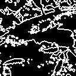  |

答案 >> [answers/answer_51.py](https://github.com/yoyoyo-yo/Gasyori100knock/blob/master/Question_51_60/answers/answer_51.py)

## Q.52. 顶帽（Top Hat）

在进行大津二值化之后，进行顶帽运算吧。

顶帽运算是原图像与开运算的结果图的差。

在这里，我们求大津二值化之后的图像和开处理（`N=3`）之后的图像的差，可以提取出细线状的部分或者噪声。

 样例图片不好突出显示顶帽运算的效果，如果找到了其它适合的图像会在这里作出更正。

| 输入 (images/imori.jpg) | 大津の二値化(answers/answer_4.jpg) | 输出(answers/answer_52.jpg) |
| :--------------: | :--------------------------------: | :-------------------------: |
|    |           | 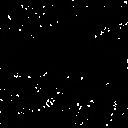  |

答案 >> [answers/answer_52.py](https://github.com/yoyoyo-yo/Gasyori100knock/blob/master/Question_51_60/answers/answer_52.py)

## Q.53. 黑帽（Black Hat）

在进行大津二值化之后，进行黑帽运算吧。

黑帽运算是原图像与闭运算的结果图的差。

在这里，我们求大津二值化之后的图像和闭处理（`N=3`）之后的图像的差，在这里和顶帽运算一样，可以提取出细线状的部分或者噪声。

样例图片不好突出显示黑帽运算的效果，如果找到了其它适合的图像会在这里作出更正。

| 输入 (images/imori.jpg) | 大津の二値化(answers/answer_4.jpg) | 输出(answers/answer_53.jpg) |
| :--------------: | :--------------------------------: | :-------------------------: |
|    |           | 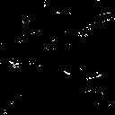  |

答案 >> [answers/answer_53.py](https://github.com/yoyoyo-yo/Gasyori100knock/blob/master/Question_51_60/answers/answer_53.py)

## Q.54. 使用误差平方和算法（Sum of Squared Difference）进行模式匹配（Template Matching）

在这里我们使用误差平方和进行模式匹配。将`imoripart.jpg`在`images/imori.jpg`中匹配的图像使用红框框出来。

模式匹配，即寻找待匹配图像和全体图像中最相似的部分，用于物体检测任务。现在虽然使用卷积神经网络（`CNN`）来检测物体，但是模式识别仍然是最基本的处理方法。

下面介绍具体算法。原图像记为I（H x W），待匹配图像为T（h x w）：

1. 对于图像I：、for ( j = 0, H-h)  for ( i = 0, W-w)在一次移动1像素的过程中，原图像I的一部分I(i:i+w, j:j+h)与待匹配图像计算相似度S。
2. S最大或最小的地方即为匹配的位置。

S的计算方法主要有 `SSD`、`SAD`（第55题）、`NCC`（第56题）、`ZNCC`（第57题）等。对于不同的方法，我们需要选择出最大值或者最小值。

在这里我们使用误差平方和`SSD`（Sum of Squared Difference）。`SSD`计算像素值的差的平方和，S取误差平方和最小的地方。

```bash
S = Sum_{x=0:w, y=0:h} (I(i+x, j+y) - T(x, y) )^2
```

顺便说一句，像模式匹配这样，从图像的左上角开始往右进行顺序查找的操作一般称作光栅扫描（Raster Scan）或者滑动窗口扫描（原文是`スライディングウィンドウ`，没有找到确定的对应英文，我觉得是 `Sliding Window`）。这样的术语在图像处理邻域经常出现。

可以使用`cv2.rectangle ()`来画矩形。另外，`imoripart.jpg`稍微改变了颜色。

> 这句话我也不知道啥意思，原文是“ちなみに imoripart.jpg は若干色味を変えています。”
>
> ——gzr

| 输入 (images/imori.jpg) | template图像(images/imori_part.jpg) | 输出(answers/answer_54.jpg) |
| :--------------: | :--------------------------: | :-------------------------: |
|    |           |   |

答案 >> [answers/answer_54.py](https://github.com/yoyoyo-yo/Gasyori100knock/blob/master/Question_51_60/answers/answer_54.py)

## Q.55. 使用绝对值差和（Sum of Absolute Differences）进行模式匹配

在这里我们使用绝对值差和进行模式匹配。将`imoripart.jpg`在`images/imori.jpg`中匹配的图像使用红框框出来。

绝对值差和（Sum of Absolute Differences）计算像素值差的绝对值之和，选取S**最小**的位置作为匹配。

```bash
S = Sum_{x=0:w, y=0:h} |I(i+x, j+y) - T(x, y)|
```

| 输入 (images/imori.jpg) | template图像(images/imori_part.jpg) | 输出(answers/answer_55.jpg) |
| :--------------: | :--------------------------: | :-------------------------: |
|    |           |   |

答案 >> [answers/answer_55.py](https://github.com/yoyoyo-yo/Gasyori100knock/blob/master/Question_51_60/answers/answer_55.py)

## Q.56. 使用归一化交叉相关（Normalization Cross Correlation）进行模式匹配

在这里我们使用归一化交叉相关进行模式匹配。将`imoripart.jpg`在`images/imori.jpg`中匹配的图像使用红框框出来。

归一化交叉相关（Normalization Cross Correlation）求出两个图像的相似度，匹配S**最大**处的图像：

```bash
     Sum_{x=0:w, y=0:h} |I(i+x, j+y) T(x, y)|
S = -----------------------------------------------------------------------------
    Sqrt(Sum_{x=0:w, y=0:h} I(i+x, j+y)^2) * Sqrt(Sum_{x=0:w, y=0:h} T(x, y)^2)
```

S最后的范围在-1<=S<=1。`NCC`对变化十分敏感。

> 原文是“`NCC`は証明変化に強いと言われる”，这句话我不知道怎么翻译为好。
>
> ——gzr

| 输入 (images/imori.jpg) | template图像(images/imori_part.jpg) | 输出(answers/answer_56.jpg) |
| :--------------: | :--------------------------: | :-------------------------: |
|    |           | 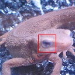  |

答案 >> [answers/answer_56.py](https://github.com/yoyoyo-yo/Gasyori100knock/blob/master/Question_51_60/answers/answer_56.py)

## Q.57. 使用零均值归一化交叉相关（Zero-mean Normalization Cross Correlation）进行模式匹配

在这里我们使用零均值归一化交叉相关进行模式匹配。将`imoripart.jpg`在`images/imori.jpg`中匹配的图像使用红框框出来。

零均值归一化交叉相关（Zero-mean Normalization Cross Correlation）求出两个图像的相似度，匹配S最大处的图像。

图像I的平均值记为mi，图像T的平均值记为mt。使用下式计算S：

```bash
       Sum_{x=0:w, y=0:h} |(I(i+x, j+y)-mi) (T(x, y)-mt)|
S = --------------------------------------------------------------------------------------
    Sqrt(Sum_{x=0:w, y=0:h} (I(i+x, j+y)-mi)^2) * Sqrt(Sum_{x=0:w, y=0:h} (T(x, y)-mt)^2)
```

S最后的范围在-1<=S<=1。零均值归一化积相关去掉平均值的话就是归一化交叉相关，据说这比归一化交叉相关对变换更加敏感（但是这里匹配失败了）。

| 输入 (images/imori.jpg) | template图像(images/imori_part.jpg) | 输出(answers/answer_57.jpg) |
| :--------------: | :--------------------------: | :-------------------------: |
|    |           | 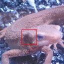  |

答案 >> [answers/answer_57.py](https://github.com/yoyoyo-yo/Gasyori100knock/blob/master/Question_51_60/answers/answer_57.py)

## Q.58. 4邻接连通域标记

将`images/seg.png`进行4邻接连通域标记吧。

连通域标记（Connected Component Labeling）是将邻接的像素打上相同的标记的作业。

也就是说：

```bash
黒　黒　黒　黒
黒　白　白　黒
黒　白　黒　黒
黒　黒　黒　黒
```

将相邻的白色像素打上相同的标记。 

像这样的像素组成的被标记的块被称为连通区域（Connected Component）。

在这里我们为4​邻域的像素打上标记。另，在这里我们使用一种被称为Lookup Table（这里我没有找到确切的中文翻译，原文是“ルックアップテーブル”，在[这里](http://imagingsolution.blog.fc2.com/blog-entry-193.html)有对Lookup Table更详尽的解释）的东西。

Lookup Table是这样的：

```bash
|   Source   |    Distination   | 
|     1      |         1        |
|     2      |         2        |
|     3      |         1        |
```

一开始被打上1标签的像素（即`Source=1`的像素）最终被分配到的标签为1（`Distination=1`）；一开始被打上3标签的像素（即`Source =3`的像素）最终被分配的的标签也为1（`Distination=1`）。

算法如下：

1. 从左上角开始进行光栅扫描。
2. 如果当前遍历到的像素`i(x,y)`是黑像素的什么也不干。如果是白像素，考察该像素的上方像素`i(x,y-1)`和左边像素`i(x-1,y)`，如果两个的取值都为0，将该像素分配一个新的标签（在这里我们用数字做标签，即1,2,\cdots原文是说“最後に割り当てたラベル + 1 を割り当てる”，直译就是分配给该像素将最后分配的标签加1数值的标签）。
3. 如果两个像素中有一个不为0（也就是说已经分配了标签），将上方和左边的像素分配的标签中数值较小的那一个（0除外）分配给当前遍历到的像素`i(x,y)`。在这里，将上方像素和左边像素的标签写入`Lookup Table`的`Source`，将当前遍历的像素`i(x,y)`分配的标签写入`Distination`。
4. 最后，对照`Lookup Table`，对像素分配的标签由`Source`变为`Distination`。


像这样的话，邻接像素就可以打上同样的标签了。因为这里是做4邻接连通域标记，所以我们只用考察上方像素和左边像素。

| 输入 (images/seg.png) | 输出(answers/answer_58.png) |
| :------------: | :-------------------------: |
|  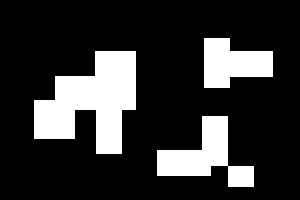  | 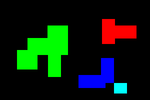  |

答案 >> [answers/answer_58.py](https://github.com/yoyoyo-yo/Gasyori100knock/blob/master/Question_51_60/answers/answer_58.py)

## Q.59. 8邻接连通域标记

在这里我们将问题58变为8邻接连通域标记。

要进行8邻接连通域标记，我们需要考察`i(x-1,y-1)`，`i(x, y-1)`，`i(x+1,y-1)`，`i(x-1,y)`这4个像素。

| 输入 (images/seg.png) | 输出(answers/answer_59.png) |
| :------------: | :-------------------------: |
|    | 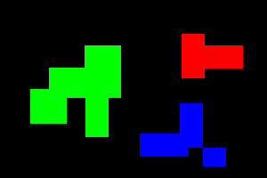  |

答案 >> [answers/answer_59.py](https://github.com/yoyoyo-yo/Gasyori100knock/blob/master/Question_51_60/answers/answer_59.py)

## Q.60. 透明混合（Alpha Blending）

将`images/imori.jpg`和`images/thorino.jpg`按照6:4的比例透明混合吧。

透明混合即通过设定透明度（Alpha值）来设定图像透明度的方法。在 OpenCV 中虽然没有透明度这个参数，但在PIL等库中有。在这里我们手动设定透明度。

将两张图片重合的时候，这个方法是有效的。

将`img1`和`img2`按1:1的比例重合的时候，使用下面的式子。通过改变 Alpha 值，你可以更改两张图片重叠的权重。

```bash
alpha = 0.5
out = img1 * alpha + img2 * (1 - alpha)
```

| 输入 (images/imori.jpg) | 输入2 (images/thorino.jpg) | 输出(answers/answer_60.jpg) |
| :--------------: | :-----------------: | :-------------------------: |
|    |  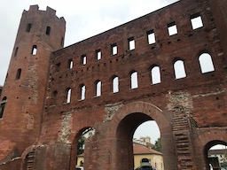   | 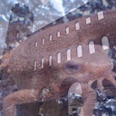  |

答案 >> [answers/answer_60.py](https://github.com/yoyoyo-yo/Gasyori100knock/blob/master/Question_51_60/answers/answer_60.py)

# Q. 61 - 70

## Q.61. 4-邻接的连接数

> [参考](http://ftp.gongkong.com/UploadFile/datum/2008-10/2008101416013500001.pdf)
>
> 关于这个我没有找到什么中文资料，只有两个差不多的 PPT 文档。下面的译法参照这个 PPT。
>
> ——gzr

请根据4-邻接的连接数将`images/renketsu.png`上色。

4连接数可以用于显示附近像素的状态。通常，对于所关注像素x0(x，y)不为零的情况，邻域定义如下：

```bash
x4(x-1,y-1) x3(x,y-1) x2(x+1,y-1)
x5(x-1,y)   x0(x,y)   x1(x+1,y)
x6(x-1,y+1) x7(x,y+1) x8(x+1,y+1)
```

这里，4-邻接的连接数通过以下等式计算：

```bash
S = (x1 - x1 x2 x3) + (x3 - x3 x4 x5) + (x5 - x5 x6 x7) + (x7 - x7 x8 x1) 
```

S的取值范围为[0,4]：
- S = 0： 内部点
- S = 1：端点
- S = 2​：连接点
- S = 3​：分支点
- S = 4：交叉点

|          输入 (images/renketsu.png)          |          输出(answers/answer_61.png)           |
| :-----------------------------------: | :--------------------------------------------: |
| 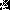 | 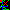 |

答案 >> [answers/answer_61.py](https://github.com/yoyoyo-yo/Gasyori100knock/blob/master/Question_61_70/answers/answer_61.py)

## Q.62. 8-邻接的连接数

请根据8-邻接的连接数将`images/renketsu.png`上色。

这里，8-邻接的连接数通过以下等式计算：

```bash
S = (x1 - x1 x2 x3) + (x3 - x3 x4 x5) + (x5 - x5 x6 x7) + (x7 - x7 x8 x1) 
```
において各x¥*の値の0と1を反転させた値を用いる。

|          输入 (images/renketsu.png)          |          输出(answers/answer_62.png)           |
| :-----------------------------------: | :--------------------------------------------: |
|  | 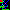 |

答案 >> [answers/answer_62.py](https://github.com/yoyoyo-yo/Gasyori100knock/blob/master/Question_61_70/answers/answer_62.py)

## Q.63. 细化处理

将`images/gazo.png`进行细化处理吧！

细化是将线条宽度设置为1的过程，按照下面的算法进行处理：

1. 从左上角开始进行光栅扫描；
2. 如果x0(x,y)=0，不处理。如果x0=(x,y)=1，满足下面三个条件时，x0=0：
   遍历到的像素4近邻像素的取值有一个以上的0；
   x0的4连接数有1；
   x0的8近邻像素中有三个以上取值为1。
3. 重复光栅扫描，直到步骤2中像素值改变次数为0。

用于细化的算法有 Hilditch 算法（问题64），Zhang-Suen 算法（问题65），田村算法等。

| 输入 (images/gazo.png) | 输出(answers/answer_63.png) |
| :-------------: | :-------------------------: |
|  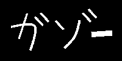  | 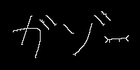  |

答案 >> [answers/answer_63.py](https://github.com/yoyoyo-yo/Gasyori100knock/blob/master/Question_61_70/answers/answer_63.py)

## Q.64. Hilditch 细化算法


将`images/gazo.png`进行 Hilditch 细化算法处理吧！

## Q.65. Zhang-Suen 细化算法

将`images/gazo.png`进行 Zhang-Suen 细化算法处理吧！

但是，请注意，有必要反转`images/gazo.png`的值，因为以下所有操作都将0作为线，将1作为背景。

对于关注像素x1(x,y)的8-近邻定义如下：

```bash
x9 x2 x3
x8 x1 x4
x7 x6 x5
```
考虑以下两个步骤：

 步骤一：执行光栅扫描并标记满足以下5个条件的所有像素：

1. 这是一个黑色像素；
2. 顺时针查看x2, x3, ..., x9, x2时，从0到1​的变化次数仅为1​；
3. x2, x3, ..., x9中1的个数在2个以上6个以下；
4. x2,x4,x6​中的一个为1​；
5. x4,x6,x8中的一个为1；

  将标记的像素变为1。

 步骤二：执行光栅扫描并标记满足以下5个条件的所有像素：

1. 这是一个黑色像素；
2. 顺时针查看x2, x3, ..., x9, x2时，从0到1的变化次数仅为1；
3. x2, x3, ..., x9中1的个数在2个以上6个以下；
4. x2,x4,x8中的一个为1；
5. x2,x6,x8中的一个为1；

  将标记的像素变为1。

反复执行步骤一和步骤二直到没有点变化（步骤一和步骤二看起来是一样的但是条件4​和条件5​有小小的差别）。

| 输入 (images/gazo.png) | 输出(answers/answer_65.png) |
| :-------------: | :-------------------------: |
|    | 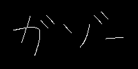  |

答案 >> [answers/answer_65.py](https://github.com/yoyoyo-yo/Gasyori100knock/blob/master/Question_61_70/answers/answer_65.py)

## Q.66. 方向梯度直方图（HOG）第一步：梯度幅值・梯度方向

求出`images/imori.jpg`的 HOG 特征量的梯度幅值和梯度方向吧！

HOG（Histogram of Oriented Gradients）是一种表示图像特征量的方法。特征量是表示图像的状态等的向量集合。

在图像识别（图像是什么）和检测（物体在图像中的哪个位置）中，我们需要：

1. 从图像中获取特征量（特征提取）；
2. 基于特征量识别和检测（识别和检测）。

由于深度学习通过机器学习自动执行特征提取和识别，所以看不到 HOG，但在深度学习变得流行之前，HOG 经常被用作特征量表达。

通过以下算法获得HOG：

1. 图像灰度化之后，在x方向和y方向上求出亮度的梯度：

```bash
x方向: gx = I(x+1, y) - I(x-1, y)
y方向: gy = I(x, y+1) - I(x, y-1)
```
2. 从gx和gy 确定梯度幅值和梯度方向：

```bash
梯度幅值: mag = sqrt(gt ** 2 + gy ** 2)
梯度方向: ang = arctan(gy / gx)
```
3. 将梯度方向[0,180]进行9等分量化。也就是说，对于[0,20]量化为 index 0，对于[20,40]量化为 index 1。
4. 将图像划分为N x  N个区域（该区域称为 cell），并作出 cell 内步骤3得到的 index 的直方图。ただし、当表示は 1 でなく勾配角度を求める。
5. C x  C个 cell 被称为一个 block。对每个 block 内的 cell 的直方图通过下面的式子进行归一化。由于归一化过程中窗口一次移动一个 cell 来完成的，因此一个 cell 会被归一化多次：

```bash
h(t) = h(t) / sqrt(Sum h(t) + epsilon)
通常　epsilon=1
```

以上，求出 HOG 特征值。

这一问，我们完成步骤1到3。

为了使示例答案更容易看出效果，`gra`是彩色的。此外，`mag`被归一化至[0,255]。

| 输入 (images/imori.jpg) | 梯度幅值(answers/answer_66_mag.jpg) | 梯度方向(answers/answer_66_gra.jpg) |
| :--------------: | :---------------------------------: | :---------------------------------: |
|    |   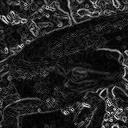    |   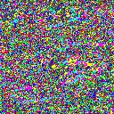    |

答案 >> [answers/answer_66.py](https://github.com/yoyoyo-yo/Gasyori100knock/blob/master/Question_61_70/answers/answer_66.py)

## Q.67. 方向梯度直方图（HOG）第二步：梯度直方图

在这里完成 HOG 的第4步。

取N=8，8 x  8个像素为一个 cell，将每个 cell 的梯度幅值加到梯度方向的 index 处。

> 我尽力翻译了，我的语文也不太好，上面那句话看不懂的可以看[这里](https://www.jianshu.com/p/395f0582c5f7)的给出的说明：
>
> 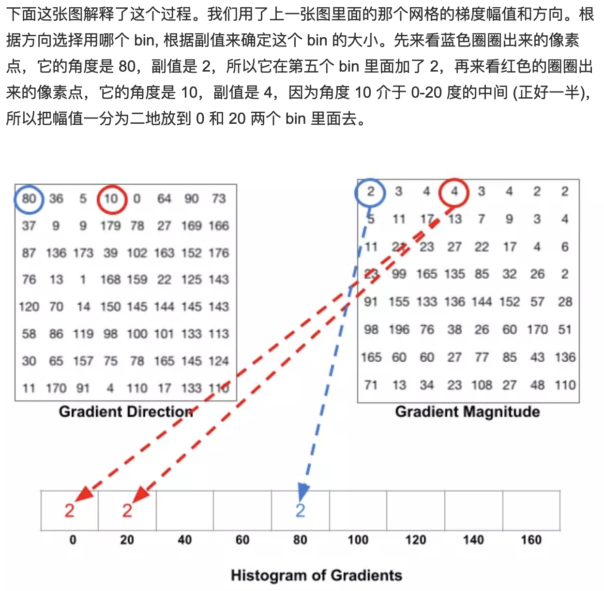
>
> ——gzr

解答为按照下面的顺序排列索引对应的直方图：
```bash
1 2 3
4 5 6
7 8 9
```
| 输入 (images/imori.jpg) |           输出(answers/answer_67.png)           |
| :--------------: | :---------------------------------------------: |
|    | 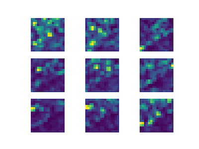 |

答案 >> [answers/answer_67.py](https://github.com/yoyoyo-yo/Gasyori100knock/blob/master/Question_61_70/answers/answer_67.py)

## Q.68. 方向梯度直方图（HOG）第三步：直方图归一化

在这里完成 HOG 的第5步。

取C=3，将3 x  3个 cell 看作一个 block，进行直方图归一化：

```bash
h(t) = h(t) / sqrt(Sum h(t) + epsilon)
通常　epsilon=1
```

在此，我们得到 HOG 特征量。

| 输入 (images/imori.jpg) |           输出(answers/answer_68.png)           |
| :--------------: | :---------------------------------------------: |
|    | 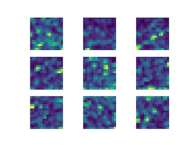 |

答案 >> [answers/answer_68.py](https://github.com/yoyoyo-yo/Gasyori100knock/blob/master/Question_61_70/answers/answer_68.py)

## Q.69. 方向梯度直方图（HOG）第四步：可视化特征量

在这里我们将得到的特征量可视化。

如果将特征量叠加在灰度化后的`images/imori.jpg`上，可以很容易看到（蝾螈的）外形。

一个好的可视化的方法是这样的，为 cell 内的每个 index 的方向画一条线段，并且值越大，线段越白，值越小，线段越黑。

解答例

| 输入 (images/imori.jpg) | 输出(answers/answer_69.jpg) |
| :--------------: | :-------------------------: |
|    | 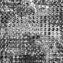  |

答案 >> [answers/answer_69.py](https://github.com/yoyoyo-yo/Gasyori100knock/blob/master/Question_61_70/answers/answer_69.py)

## Q.70. 色彩追踪（Color Tracking）

在 HSV 色彩空间内对`images/imori.jpg`创建一个只有蓝色部分值为255的图像。

色彩追踪是提取特定颜色的区域的方法。

然而，由于在 RGB 色彩空间内颜色有256 ^ 3种，因此十分困难（或者说手动提取相当困难），因此进行 HSV 变换。

HSV 变换在问题5中提到过，是将 RGB 变换到色相（Hue）、饱和度（Saturation）、明度（Value）的方法。

- 饱和度越小越白，饱和度越大颜色越浓烈，0<=S<=1；

- 明度数值越高越接近白色，数值越低越接近黑色（0<=V<=1）；

- 色相：将颜色使用0到360度表示，具体色相与数值按下表对应：

  |  红  |  黄  |  绿  | 青色 | 蓝色 | 品红 |  红  |
  | :--: | :--: | :--: | :--: | :--: | :--: | :--: |
  |  0°  | 60°  | 120° | 180° | 240° | 300° | 360° |

也就是说，为了追踪蓝色，可以在进行 HSV 转换后提取其中180<=H<=260的位置，将其变为255。

| 输入 (images/imori.jpg) | 输出(answers/answer_70.png) |
| :--------------: | :-------------------------: |
|    | 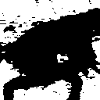  |

答案 >> [answers/answer_70.py](https://github.com/yoyoyo-yo/Gasyori100knock/blob/master/Question_61_70/answers/answer_70.py)

# Q. 71 - 80

## Q.71. 掩膜（Masking）

使用`HSV`对`images/imori.jpg`进行掩膜处理，只让蓝色的地方变黑。

像这样通过使用黑白二值图像将对应于黑色部分的原始图像的像素改变为黑色的操作被称为掩膜。

要提取蓝色部分，请先创建这样的二进制图像，使得`HSV`色彩空间中180<=H<=260的位置的像素值设为1，并将其0和1反转之后与原始图像相乘。

这使得可以在某种程度上将蝾螈（从背景上）分离出来。

| 输入 (images/imori.jpg) | マスク(answers/answer_70.png) | 输出(answers/answer_71.jpg) |
| :--------------: | :---------------------------: | :-------------------------: |
|    |     | 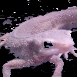  |

答案 >> [answers/answer_71.py](https://github.com/yoyoyo-yo/Gasyori100knock/blob/master/Question_71_80/answers/answer_71.py)

## Q.72. 掩膜（色彩追踪（Color Tracking）+形态学处理）

在问题71中掩膜并不是十分精细，蝾螈的眼睛被去掉，背景也有些许残留。

因此，可以通过对掩膜图像应用`N = 5`闭运算（问题50）和开运算（问题49），以使掩膜图像准确。

| 输入 (images/imori.jpg) | マスク(answers/answer_72_mask.png) | 输出(answers/answer_72.jpg) |
| :--------------: | :--------------------------------: | :-------------------------: |
|    |  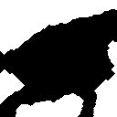   | 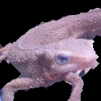  |

答案 >> [answers/answer_72.py](https://github.com/yoyoyo-yo/Gasyori100knock/blob/master/Question_71_80/answers/answer_72.py)

## Q.73. 缩小和放大

将`images/imori.jpg`进行灰度化处理之后，先缩小至原来的0.5倍，再放大两倍吧。这样做的话，会得到模糊的图像。

放大缩小的时候使用双线性插值。如果将双线性插值方法编写成函数的话，编程会变得简洁一些。

| 输入 (images/imori.jpg) | 输出(answers/answer_73.jpg) |
| :--------------: | :-------------------------: |
|    | 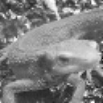  |

答案 >> [answers/answer_73.py](https://github.com/yoyoyo-yo/Gasyori100knock/blob/master/Question_71_80/answers/answer_73.py)

## Q.74. 使用差分金字塔提取高频成分

求出问题73中得到的图像与原图像的差，并将其正规化至[0,255]​范围。

ここで求めた图像はエッジとなっている。つまり、图像中の高周波成分をとったことになる。

| 输入 (images/imori.jpg) | 输出(answers/answer_74.jpg) |
| :--------------: | :-------------------------: |
|    | 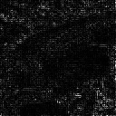  |

答案 >> [answers/answer_74.py](https://github.com/yoyoyo-yo/Gasyori100knock/blob/master/Question_71_80/answers/answer_74.py)

## Q.75. 高斯金字塔（Gaussian Pyramid）

在这里我们求出原图像1/2, 1/4, 1/8, 1/16, 1/32大小的图像。

像这样把原图像缩小之后（像金字塔一样）重叠起来的就被称为高斯金字塔。

这种高斯金字塔的方法现在仍然有效。高斯金字塔的方法也用于提高图像清晰度的超分辨率成像（Super-Resolution ）深度学习方法。

| 输入 (images/imori.jpg) | 1/1(answers/answer_75_1.jpg) |             1/2              |             1/4              |             1/8              |             1/16              |             1/32              |
| :--------------: | :--------------------------: | :--------------------------: | :--------------------------: | :--------------------------: | :---------------------------: | :---------------------------: |
|    |  | 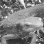 | 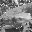 | 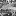 | 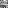 | 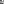 |

答案 >> [answers/answer_75.py](https://github.com/yoyoyo-yo/Gasyori100knock/blob/master/Question_71_80/answers/answer_75.py)

## Q.76. 显著图（Saliency Map）

在这里我们使用高斯金字塔制作简单的显著图。

显著图是将一副图像中容易吸引人的眼睛注意的部分（突出）表现的图像。

虽然现在通常使用深度学习的方法计算显著图，但是一开始人们用图像的`RGB`成分或者`HSV`成分创建高斯金字塔，并通过求差来得到显著图（例如[Itti等人的方法](http://ilab.usc.edu/publications/doc/IttiKoch00vr.pdf)）。

在这里我们使用在问题75中得到的高斯金字塔来简单地求出显著图。算法如下：

1. 我们使用双线性插值调整图像大小至1/128, 1/64, 1/32, ……，一开始是缩放至1/128。
2. 将得到的金字塔（我们将金字塔的各层分别编号为0,1,2,3,4,5）两两求差。
3. 将第2步中求得的差分全部相加，并正规化至[0,255]。

完成以上步骤就可以得到显著图了。虽然第2步中并没有指定要选择哪两张图像，但如果选择两个好的图像，则可以像答案那样得到一张显著图。

从图上可以清楚地看出，蝾螈的眼睛部分和颜色与周围不太一样的地方变成了白色，这些都是人的眼睛容易停留的地方。

解答例( (0,1), (0,3), (0,5), (1,4), (2,3), (3,5) を使用)

| 输入 (images/imori.jpg) | 输出(answers/answer_76.jpg) |
| :--------------: | :-------------------------: |
|    | 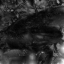  |

答案 >> [answers/answer_76.py](https://github.com/yoyoyo-yo/Gasyori100knock/blob/master/Question_71_80/answers/answer_76.py)


## Q.77. Gabor 滤波器（Gabor Filter）

来进行Gabor 滤波吧。

Gabor 滤波器是一种结合了高斯分布和频率变换的滤波器，用于在图像的特定方向提取边缘。

滤波器由以下式子定义：

```bash
G(y, x) = exp(-(x'^2 + g^2 y'^2) / 2 s^2) * cos(2 pi x' / l + p)
x' = cosA * x + sinA * y
y' = -sinA * x + cosA * y

y, x 滤波器的位置　滤波器的大小如果为K的话、 y, x 取 [-K//2, k//2]。
g ... gamma Gabor 滤波器的椭圆度
s ... sigma 高斯分布的标准差
l ... lambda 余弦函数的波长参数
p ... 余弦函数的相位参数
A ... Gabor 滤波核中平行条带的方向
```

在这里，取K=111, s=10, g = 1.2, l =10, p=0, A=0，可视化 Gabor 滤波器吧！

实际使用 Gabor 滤波器时，通过归一化以使滤波器值的绝对值之和为1​使其更易于使用。

在答案中，滤波器值被归一化至[0,255]以进行可视化。

|输出(answers/answer_77.jpg)|
|:---:|
|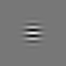|

答案 >> [answers/answer_77.py](https://github.com/yoyoyo-yo/Gasyori100knock/blob/master/Question_71_80/answers/answer_77.py)

## Q.78. 旋转 Gabor 滤波器

在这里分别取 A=0, 45, 90, 135来求得旋转 Gabor 滤波器。其它参数和问题77一样，K=111, s=10, g = 1.2, l =10, p=0。

Gabor 滤波器可以通过这里的方法简单实现。

|输出(answers/answer_78.png)|
|:---:|
|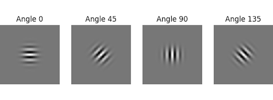|

答案 >> [answers/answer_78.py](https://github.com/yoyoyo-yo/Gasyori100knock/blob/master/Question_71_80/answers/answer_78.py)

## Q.79. 使用 Gabor 滤波器进行边缘检测

将`images/imori.jpg`灰度化之后，分别使用A=0, 45, 90, 135的 Gabor 滤波器进行滤波。其它参数取为：K=11, s=1.5, g=1.2, l=3, p=0。

如在答案示例看到的那样， Gabor滤波器提取了指定的方向上的边缘。因此，Gabor 滤波器在边缘特征提取方面非常出色。

一般认为 Gabor 滤波器接近生物大脑视皮层中的初级简单细胞（V1 区）。也就是说，当生物看见眼前的图像时也进行了特征提取。つまり生物が見ている時の眼の前の图像の特徴抽出を再現しているともいわれる。

一般认为深度学习的卷积层接近 Gabor 滤波器的功能。然而，在深度学习中，滤波器的系数通过机器学习自动确定。作为机器学习的结果，据说将发生类似于 Gabor 滤波器的过程。

| 输入 (images/imori.jpg) | 输出(answers/answer_79.png) |
| :--------------: | :-------------------------: |
|    | 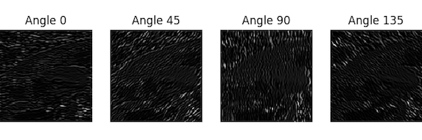  |

答案 >> [answers/answer_79.py](https://github.com/yoyoyo-yo/Gasyori100knock/blob/master/Question_71_80/answers/answer_79.py)

## Q.80. 使用 Gabor 滤波器进行特征提取

通过将问题79中得到的4张图像加在一起，提取图像的特征。

观察得到的结果，图像的轮廓部分是白色的，获得了类似于边缘检测的输出。

深度学习中的卷积神经网络，最初已经具有提取图像的特征的功能，在不断重复特征提取的计算过程中，自动提取图像的特征。

| 输入 (images/imori.jpg) | 输出(answers/answer_80.jpg) |
| :--------------: | :-------------------------: |
|    | 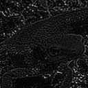  |

答案 >> [answers/answer_80.py](https://github.com/yoyoyo-yo/Gasyori100knock/blob/master/Question_71_80/answers/answer_80.py)

# Q. 81 - 90

## Q.81. Hessian 角点检测

对`images/thorino.jpg`进行Hessian 角点检测吧！

角点检测是检测边缘上的角点。

角点是曲率变大的点，下式定义了高斯曲率：

```bash
ガウス曲率 K = det(H) / (1 + Ix^2 + Iy^2)^2

det(H) = Ixx Iyy - IxIy^2
H ... ヘシアン行列。画像の二次微分(グレースケール画像などに対して、Sobelフィルタを掛けて求められる)。画像上の一点に対して、次式で定義される。
Ix ... x方向のsobelフィルタを掛けたもの。 Iy ... y方向のsobelフィルタ
H = [ Ix^2  IxIy]
      IxIy  Iy^2
```

ヘシアンのコーナー検出では、det(H)が極大点をコーナーとみなす。
極大点は注目画素と8近傍を比較して、注目画素の値が最大であれば極大点として扱う。

解答ではdet(H)が極大点かつ、max(H)*0.1以上である点をコーナーとしている。

| 输入 (images/thorino.jpg) | 输出(answers/answer_81.jpg) |
| :----------------: | :-------------------------: |
|    | 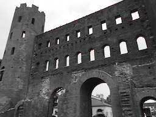  |

答案 >> [answers/answer_81.py](https://github.com/yoyoyo-yo/Gasyori100knock/blob/master/Question_81_90/answers/answer_81.py)

## Q.82. Harris 角点检测第一步：Sobel + Gausian

问题82和问题83对`images/thorino.jpg`进行 Harris 角点检测吧！

Harris 角点检测算法如下：

1. 对图像进行灰度化处理；
2. 利用 Sobel 滤波器求出海森矩阵（Hessian matrix）：
```bash
H = [ Ix^2  IxIy]
      IxIy  Iy^2
```
3. Ix^2, Iy^2, IxIyにそれぞれガウシアンフィルターをかける。
4. 计算每个像素的 R = det(H) - k (trace(H))^2。通常K取 [0.04,0.16].
5. 满足 R >= max(R) * th  的像素点即为角点（th 多取 0.1）。

问题82至问题83中的参数如下：

* 高斯滤波器：(k=3, sigma=3)；
*  K = 0.04, th = 0.1。

在这里我们完成步骤1到步骤3。

| 输入 (images/thorino.jpg) | 输出(answers/answer_82.png) |
| :----------------: | :-------------------------: |
|    | 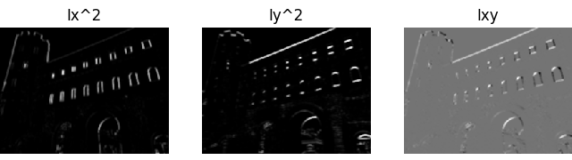  |

答案 >> [answers/answer_82.py](https://github.com/yoyoyo-yo/Gasyori100knock/blob/master/Question_81_90/answers/answer_82.py)

## Q.83. Harris 角点检测第二步：角点检测

在这里进行算法的步骤4​和步骤5​吧！

在步骤4​中，k = 0.04​；在步骤5​中th = 0.1​。

| 输入 (images/thorino.jpg) | 输出(answers/answer_83.jpg) |
| :----------------: | :-------------------------: |
|    | 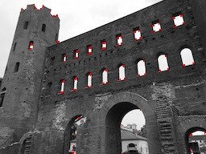  |

答案 >> [answers/answer_83.py](https://github.com/yoyoyo-yo/Gasyori100knock/blob/master/Question_81_90/answers/answer_83.py)

## Q.84. 简单图像识别第一步：减色化+直方图

这里我们进行简单的图像识别。

图像识别是识别图像中物体的类别（它属于哪个类）的任务。图像识别通常被称为Classification、Categorization、Clustering等。

一种常见的方法是通过 HOG、SIFT、SURF 等方法从图像中提取一些特征，并通过特征确定物体类别。这种方法在CNN普及之前广泛采用，但 CNN 可以完成从特征提取到分类等一系列任务。

这里，利用图像的颜色直方图来执行简单的图像识别。算法如下：

1. 将图像`train.jpg`进行减色处理（像问题6中那样，RGB 取4种值）。
2. 创建减色图像的直方图。直方图中，RGB 分别取四个值，但为了区分它们，B = [1,4],G = [5,8],R = [9,12],bin=12。请注意，我们还需要为每个图像保存相应的直方图。也就是说，需要将数据储存在`database = np.zeros((10(训练数据集数), 13(RGB + class), dtype=np.int)`中。
3. 将步骤2中计算得到的直方图记为 database。
4. 计算想要识别的图像`test@@@.jpg`与直方图之间的差，将差称作特征量。
5. 直方图的差异的总和是最小图像是预测的类别。换句话说，它被认为与近色图像属于同一类。
6. 認識したい画像とヒストグラムの差を計算して、特徴量とする。
7. ヒストグラムの差の合計で、最小となった画像が予測となるクラスである。つまり、色が近い画像と同じクラスになると考えられる。

在这里，实现步骤1至步骤3并可视化直方图。

训练数据集存放在文件夹`dataset`中，分为`trainakahara@@@.jpg`（类别1）和`trainmadara@@@.jpg`（类别2）两类，共计10张。`akahara`是红腹蝾螈（Cynops pyrrhogaster），`madara`是理纹欧螈（Triturus marmoratus）。

这种预先将特征量存储在数据库中的方法是第一代人工智能方法。这个想法是逻辑是，如果你预先记住整个模式，那么在识别的时候就没有问题。但是，这样做会消耗大量内存，这是一种有局限的方法。


|输出(answers/answer_84.png)|
|:---:|
|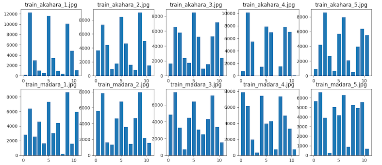|

答案 >> [answers/answer_84.py](https://github.com/yoyoyo-yo/Gasyori100knock/blob/master/Question_81_90/answers/answer_84.py)

```bash
被存储的直方图的内容
[[  172 12254  2983   975   485 11576  3395   928   387 10090  4845  1062  0]
[ 3627  7350  4420   987  1743  8438  4651  1552   848  9089  4979  1468  0]
[ 1646  6547  5807  2384  1715  8502  5233   934  1553  5270  7167  2394  0]
[  749 10142  5465    28  1431  7922  7001    30  1492  7819  7024    49  0]
[  927  4197  8581  2679   669  5689  7959  2067   506  3973  6387  5518  0]
[ 2821  6404  2540  4619  1625  7317  3019  4423   225  8635  1591  5933  1]
[ 5575  7831  1619  1359  4638  6777  3553  1416  4675  7964  2176  1569  1]
[ 4867  7523  3275   719  4457  6390  3049  2488  4328  7135  3377  1544  1]
[ 7881  6160  1992   351  7426  3967  4258   733  7359  4979  3322   724  1]
[ 5638  6580  3916   250  5041  4185  6286   872  5226  4930  5552   676  1]]
```

## Q.85. 简单图像识别第二步：判别类别

在这里我们完成算法的4至5步。

请使用测试数据集`testakahara@@@.jpg`和`testmadara@@@.jpg`（共计4张）。请输出各个与各个图像直方图差别最小的（训练数据集的）文件名和预测类别。这种评价方法被称为最近邻法（Neareset Neighbour）。

答案如下：

```bash
test_akahara_1.jpg is similar >> train_akahara_3.jpg  Pred >> akahara
test_akahara_2.jpg is similar >> train_akahara_1.jpg  Pred >> akahara
test_madara_1.jpg is similar >> train_madara_2.jpg  Pred >> madara
test_madara_2.jpg is similar >> train_akahara_2.jpg  Pred >> akahara
```
答案 >> [answers/answer_85.py](https://github.com/yoyoyo-yo/Gasyori100knock/blob/master/Question_81_90/answers/answer_85.py)

## Q.86. 简单图像识别第三步：评估

在这里对图像识别的结果做评估。

正确率（Accuracy, Precision）用来表示多大程度上分类正确，在图像识别任务上是一般性的评价指标。正确率通过下式计算。要はテストにおける得点率である。当得到的值有小数时，也可以用百分比表示。

```bash
Accuracy = (正解した画像数) / (テストした画像の総数)
```

按照上面的方法，求出问题85中的正确率吧！答案如下：

```bash
Accuracy >> 0.75 (3/4)
```
答案 >> [answers/answer_86.py](https://github.com/yoyoyo-yo/Gasyori100knock/blob/master/Question_81_90/answers/answer_86.py)

## Q.87. 简单图像识别第四步：k-NN

问题85中虽然我们预测了颜色最接近的图像，但实际上和`testmadara2.jpg`最接近的是`trainakahara2.jpg`。

|   test_marada_2.jpg    |   train_akahara_2.jpg    |
| :--------------------: | :----------------------: |
|  |  |

如果比较这两个图像，它们绿色和黑色比例看起来差不多，因此整个图像颜色看起来相同。これは認識時のサンプルを一つにしたことによって、例外的な画像が選ばれてしまったためである。因此，训练数据集的特征不能很好地分离，并且有时包括偏离特征分布的样本。

为了避免这中情况发生，在这里我们选择颜色相近的三副图像，并通过投票来预测最后的类别，再计算正确率。

像这样选择具有相似特征的3​个学习数据的方法被称为 k-近邻算法（k-NN: k-Nearest Neighbor）。 问题85​中的NN 方法是 k = 1​ 的情况。

答案：

```bash
test_akahara_1.jpg is similar >> train_akahara_3.jpg, train_akahara_2.jpg, train_akahara_4.jpg, |Pred >> akahara
test_akahara_2.jpg is similar >> train_akahara_1.jpg, train_akahara_2.jpg, train_akahara_4.jpg, |Pred >> akahara
test_madara_1.jpg is similar >> train_madara_2.jpg, train_madara_4.jpg, train_madara_3.jpg, |Pred >> madara
test_madara_2.jpg is similar >> train_akahara_2.jpg, train_madara_3.jpg, train_madara_2.jpg, |Pred >> madara
Accuracy >> 1.0 (4/4)
```

答案 >> [answers/answer_87.py](https://github.com/yoyoyo-yo/Gasyori100knock/blob/master/Question_81_90/answers/answer_87.py)

## Q.88. k-平均聚类算法（k -means Clustering）第一步：生成质心

问题84至问题87的图像识别任务是需要预期输出的简单监督学习（supervised-training）中的一种简单情况。在这里我们通过不需要预期输出的无监督学习（unsupervised-training）来进行图像分类。

最简单的方法是 k-平均聚类算法（k -means Clustering）。

k-平均聚类算法在类别数已知时使用。在质心不断明确的过程中完成特征量的分类任务。

k-平均聚类算法如下：

1. 为每个数据随机分配类；
2. 计算每个类的重心；
3. 计算每个数据与重心之间的距离，将该数据分到重心距离最近的那一类；
4. 重复步骤2和步骤3直到没有数据的类别再改变为止。

在这里，以减色化和直方图作为特征量来执行以下的算法：

1. 对图像进行减色化处理，然后计算直方图，将其用作特征量；
2. 对每张图像随机分配类别0或类别1（在这里，类别数为2，以`np.random.seed (1)`作为随机种子生成器。当`np.random.random`小于`th`时，分配类别0；当`np.random.random`大于等于`th`时，分配类别1，在这里`th=0.5`）；
3. 分别计算类别0和类别1的特征量的质心（质心存储在`gs = np.zeros((Class, 12), dtype=np.float32)`中）；
4. 对于每个图像，计算特征量与质心之间的距离（在此取欧氏距离），并将图像指定为质心更接近的类别。
5. 重复步骤3和步骤4直到没有数据的类别再改变为止。

在这里，实现步骤1​至步骤3​吧（步骤4​和步骤5​的循环不用实现）！将图像`test@@@.jpg`进行聚类。

答案：

```bash
assigned label
[[ 1493  7892  4900  2099  1828  9127  4534   895  1554  6750  5406  2674 0]
[  242 10338  3628  2176   587 12212  2247  1338   434 10822  4506   622 1]
[ 6421  5478   719  3766  5482  4294  2537  4071  5609  4823  2051  3901 0]
[ 3343  8134  4756   151  3787  7588  3935  1074  3595  8444  4069   276 0]]
Grabity
[[ 3752.3333  7168.      3458.3333  2005.3334  3699.      7003.
3668.6667  2013.3334  3586.      6672.3335  3842.      2283.6667]
[  242.     10338.      3628.      2176.       587.     12212.
2247.      1338.       434.     10822.      4506.       622.    ]]
```

答案 >> [answers/answer_88.py](https://github.com/yoyoyo-yo/Gasyori100knock/blob/master/Question_81_90/answers/answer_88.py)

## Q.89. k-平均聚类算法（k -means Clustering）第二步：聚类（Clustering）

在这里完成算法的步骤4和步骤5，进行聚类吧！

在这里预测类别为0和1，但顺序与问题85​至87​不同。

因此，k-平均聚类算法是一种完全按范围划分类别的方法。一条数据最后被划分到什么类别只有到最后才清楚。此外，必须预先知道类别的数量。

需要注意的是，k-平均聚类算法最初分配的类别对最后的结果有很大的影响。并且，数据量小的情况下极有可能失败。也就是说，数据量越大最后得到的数据分布越准确。

答案：

```bash
test_akahara_1.jpg  Pred: 0
test_akahara_2.jpg  Pred: 1
test_madara_1.jpg  Pred: 0
test_madara_2.jpg  Pred: 0
```

答案 >> [answers/answer_89.py](https://github.com/yoyoyo-yo/Gasyori100knock/blob/master/Question_81_90/answers/answer_89.py)

## Q.90. k-平均聚类算法（k -means Clustering）第三步：调整初期类别

使用k-平均聚类算法将8张`train@@@.jpg`完美地聚类吧！

在这里，通过变更`np.random.seed()`的值和`np.random.random() < th`中分割类别的阈值`th`来更好地预测图片的类别吧！由于`train@@@.jpg`的图像数量是问题89​的两倍，因此可以更容易地聚类。

这只能通过反复试验来完成。

答案：

```bash
train_akahara_1.jpg  Pred: 1
train_akahara_2.jpg  Pred: 1
train_akahara_3.jpg  Pred: 1
train_akahara_4.jpg  Pred: 1
train_akahara_5.jpg  Pred: 1
train_madara_1.jpg  Pred: 0
train_madara_2.jpg  Pred: 0
train_madara_3.jpg  Pred: 0
train_madara_4.jpg  Pred: 0
train_madara_5.jpg  Pred: 0
```

答案 >> [answers/answer_90.py](https://github.com/yoyoyo-yo/Gasyori100knock/blob/master/Question_81_90/answers/answer_90.py)

# Q. 91 - 100

## Q.91. 利用 k-平均聚类算法进行减色处理第一步----按颜色距离分类

对`images/imori.jpg`利用 k-平均聚类算法进行减色处理。

在问题6中涉及到了减色处理，但是问题6中事先确定了要减少的颜色。这里，k-平均聚类算法用于动态确定要减少的颜色。

算法如下：

1. 从图像中随机选取 K 个 RGB 分量（这我们称作类别）。
2. 将图像中的像素分别分到颜色距离最短的那个类别的索引中去，色彩距离按照下面的方法计算：

```bash
色の距離 dis = sqrt( (R-R')^2 + (G-G')^2 + (B-B')^2)
```
3. 计算各个索引下像素的颜色的平均值，这个平均值成为新的类别；
4. 如果原来的类别和新的类别完全一样的话，算法结束。如果不一样的话，重复步骤2和步骤3；
5. 将原图像的各个像素分配到色彩距离最小的那个类别中去。

在这里完成步骤1和步骤2。
- 类别数K=5；
- 在这里使用`reshape((HW, 3))`来改变图像大小之后图像将更容易处理；
- 步骤1中，对于`np.random.seed(0)`，使用`np.random.choice(np.arrange(图像的HW), 5, replace=False)`；
- 现在先不考虑步骤3到步骤5的循环。


```bash
# 最初选择的颜色
[[140. 121. 148.]
 [135. 109. 122.]
 [211. 189. 213.]
 [135.  86.  84.]
 [118.  99.  96.]]
```

最初に選ばれた色との色の距離でクラスのインデックスをつけたもの(アルゴリズム2)。
解答では0-4にインデックスの値をx50にして見やすいようにしている。

| 输入 (images/imori.jpg) | 输出(answers/answer_91.jpg) |
| :--------------: | :-------------------------: |
|    | 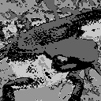  |

答案 >> [answers/answer_91.py](https://github.com/yoyoyo-yo/Gasyori100knock/blob/master/Question_91_100/answers/answer_91.py)

## Q.92. 利用 k-平均聚类算法进行减色处理第二步----减色处理

在这里实现算法的第3到5步。

```bash
# 选择的颜色
[[182.86730957 156.13246155 180.24510193]
 [156.75152588 123.88993835 137.39085388]
 [227.31060791 199.93135071 209.36465454]
 [ 91.9105835   57.94448471  58.26378632]
 [121.8759613   88.4736557   96.99688721]]
```

减色处理可以将图像处理成手绘风格。如果k=10，则可以在保持一些颜色的同时将图片处理成手绘风格。

现在，k=5的情况下试着将`images/madara.jpg`进行减色处理。

| 输入 (images/imori.jpg) | 输出(answers/answer_92.jpg) | k=10(answers/answer_92_k10.jpg) | 输入2 (images/madara.jpg) | 输出(answers/answer_92_m.jpg) |
| :--------------: | :-------------------------: | :-----------------------------: | :----------------: | :---------------------------: |
|    | 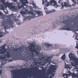  | 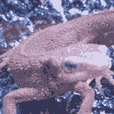  |  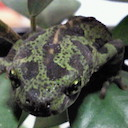   | 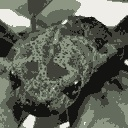  |

答案 >> [answers/answer_92.py](https://github.com/yoyoyo-yo/Gasyori100knock/blob/master/Question_91_100/answers/answer_92.py)


## Q.93. 准备机器学习的训练数据第一步----计算 IoU

从这里开始我们准备机器学习用的训练数据。

最终，我想创建一个能够判断图像是否是蝾螈的脸的判别器。为此，我们需要蝾螈的脸部图像和非蝾螈脸部的图像是。それらを用意するためのprogramを作成する。

为此，有必要从单个图像中用矩形框出蝾螈头部（即 Ground-truth），如果随机切割的矩形与 Ground-truth在一定程度上重合，那么这个矩形框处就是蝾螈的头。

重合程度通过检测评价函数（Intersection over Union）来判断。通过下式进行计算：

```bash
R1...Ground-truth的范围 , R2...随机框出来的矩形 , Rol...为R1和R2重合的范围
IoU = |Rol| / |R1 + R2 - Rol|
```

在这里计算以下两个矩形的 IoU 吧！

```python
# [x1, y1, x2, y2] x1,y1...矩形の左上のx,y  x2,y2...矩形の右下のx,y
a = np.array((50, 50, 150, 150), dtype=np.float32)

b = np.array((60, 60, 170, 160), dtype=np.float32)
```

答案

```bash
0.627907
```
答案 >> [answers/answer_93.py](https://github.com/yoyoyo-yo/Gasyori100knock/blob/master/Question_91_100/answers/answer_93.py)

## Q.94. 准备机器学习的训练数据第一步----随机裁剪（Random Cropping）

下面，通过从`imori1.jpg`中随机裁剪图像制作训练数据。

这里，从图像中随机切出200个60 x 60的矩形。

并且，满足下面的条件：

1. 使用`np.random.seed(0)`，求出裁剪的矩形的左上角座标`x1 = np.random.randint(W-60)`和`y1=np.random.randint(H-60)`；
2. 如果和 Ground-truth （`gt = np.array((47, 41, 129, 103), dtype=np.float32)`）的 IoU 大于 0.5，那么就打上标注 1，小于 0.5 就打上标注 0。

答案中，标注 1 的矩形用红色画出，标注 0 的矩形用蓝色的线画出，Ground-truth 用绿色的线画出。在这里我们简单地准备蝾螈头部和头部以外的图像。

| 输入 (images/imori_1.jpg) | 输出(answers/answer_94.jpg) |
| :----------------: | :-------------------------: |
|  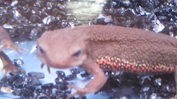  | 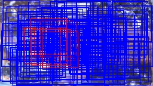  |

答案 >> [answers/answer_94.py](https://github.com/yoyoyo-yo/Gasyori100knock/blob/master/Question_91_100/answers/answer_94.py)

## Q.95. 神经网络（Neural Network）第一步----深度学习（Deep Learning）

在这里将神经网络作为分类器，这就是现在流行的深度学习。

下面的代码是包含输入层、中间层（Unit 数：64）、输出层（1）的网络。这是实现异或逻辑的网络。网络代码参照了[这里](https://towardsdatascience.com/how-to-build-your-own-neural-network-from-scratch-in-python-68998a08e4f6)：

```python
import numpy as np

np.random.seed(0)

class NN:
    def __init__(self, ind=2, w=64, outd=1, lr=0.1):
        self.w1 = np.random.normal(0, 1, [ind, w])
        self.b1 = np.random.normal(0, 1, [w])
        self.wout = np.random.normal(0, 1, [w, outd])
        self.bout = np.random.normal(0, 1, [outd])
        self.lr = lr

    def forward(self, x):
        self.z1 = x
        self.z2 = sigmoid(np.dot(self.z1, self.w1) + self.b1)
        self.out = sigmoid(np.dot(self.z2, self.wout) + self.bout)
        return self.out

    def train(self, x, t):
        # backpropagation output layer
        #En = t * np.log(self.out) + (1-t) * np.log(1-self.out)
        En = (self.out - t) * self.out * (1 - self.out)
        grad_En = En #np.array([En for _ in range(t.shape[0])])
        grad_wout = np.dot(self.z2.T, En)
        grad_bout = np.dot(np.ones([En.shape[0]]), En)
        self.wout -= self.lr * grad_wout#np.expand_dims(grad_wout, axis=-1)
        self.bout -= self.lr * grad_bout

        # backpropagation inter layer
        grad_u1 = np.dot(En, self.wout.T) * self.z2 * (1 - self.z2)
        grad_w1 = np.dot(self.z1.T, grad_u1)
        grad_b1 = np.dot(np.ones([grad_u1.shape[0]]), grad_u1)
        self.w1 -= self.lr * grad_w1
        self.b1 -= self.lr * grad_b1

def sigmoid(x):
    return 1. / (1. + np.exp(-x))

train_x = np.array([[0,0], [0,1], [1,0], [1,1]], dtype=np.float32)
train_t = np.array([[0], [1], [1], [0]], dtype=np.float32)

nn = NN(ind=train_x.shape[1])

# train
for i in range(1000):
    nn.forward(train_x)
    nn.train(train_x, train_t)

# test
for j in range(4):
    x = train_x[j]
    t = train_t[j]
    print("in:", x, "pred:", nn.forward(x))
```

在这里，我们可以再增加一层中间层进行学习和测试。

答案：

```bash
in: [0. 0.] pred: [0.03724313]
in: [0. 1.] pred: [0.95885516]
in: [1. 0.] pred: [0.9641076]
in: [1. 1.] pred: [0.03937037]
```

答案 >> [answers/answer_95.py](https://github.com/yoyoyo-yo/Gasyori100knock/blob/master/Question_91_100/answers/answer_95.py)

## Q.96. 神经网络（Neural Network）第二步----训练

在这里，将问题94中准备的200 个训练数据的 HOG 特征值输入到问题94​中的神经网络中进行学习。

在这里，对于输出大于 0.5 的打上标注 1，小于 0.5 的打上标注 0，对训练数据计算准确率。训练参数如下：

- 学习率：lr=0.01；
- epoch=10000​；
- 将裁剪的图像调整为32 x 32，并计算 HOG 特征量（HOG 中1个 cell 的大小为8 x 8）。

```bash
Accuracy >> 1.0 (200.0 / 200)
```

答案 >> [answers/answer_96.py](https://github.com/yoyoyo-yo/Gasyori100knock/blob/master/Question_91_100/answers/answer_96.py)

## Q.97. 简单物体检测第一步----滑动窗口（Sliding Window）+HOG

从这里开始进行物体检测吧！

物体检测是检测图像中到底有什么东西的任务。例如，图像在[x1, y1, x2, y2]处有一只狗。像这样把物体圈出来的矩形我们称之为 Bounding-box。

下面实现简单物体检测算法：

1. 从图像左上角开始进行滑动窗口扫描；
2. 对于每个图像位置，以目标位置为中心准备多个矩形；
3. 裁剪出每个矩形对应的图像，并对图像提取特征（HOG，SIFT等）；
4. 使用分类器（CNN，SVM等）以确定每个矩形是否包含目标。

これである程度の物体と矩形の座標が得られる。目前，物体检测主要通过深度学习（Faster R-CNN、YOLO、SSD等）进行，但是这种滑动窗口方法在深度学习开始流行之前已成为主流。为了学习检测的基础知识我们使用滑动窗口来进行检测。

在这里我们实现步骤1至步骤3。

在`imorimany.jpg`上检测蝾螈的头吧！条件如下：

- 矩形使用以下方法表示
```python
# [h, w]
recs = np.array(((42, 42), (56, 56), (70, 70)), dtype=np.float32)
```
- 滑动步长为4个像素（每次滑动一个像素固然是好的，但这样需要大量计算，处理时间会变长）；
- 如果矩形超过图像边界，改变矩形的形状使其不超过图像的边界；
- 将裁剪出的矩形部分大小调整为32 x 32；
- 计算 HOG 特征值时 cell 大小取8 x 8。

答案 >> [answers/answer_97.py](https://github.com/yoyoyo-yo/Gasyori100knock/blob/master/Question_91_100/answers/answer_97.py)

## Q.98. 简单物体检测第二步----滑动窗口（Sliding Window）+ NN

对于`imorimany.jpg`，在这里将问题97中求得的各个矩形的 HOG 特征值输入问题96中训练好的神经网络中进行蝾螈头部识别。

在此，绘制预测概率大于0.7的矩形。

下面的答案内容为检测矩形的[x1, y1, x2, y2, score]：

```bash
[[ 27.           0.          69.          21.           0.74268049]
[ 31.           0.          73.          21.           0.89631011]
[ 52.           0.         108.          36.           0.84373157]
[165.           0.         235.          43.           0.73741703]
[ 55.           0.          97.          33.           0.70987278]
[165.           0.         235.          47.           0.92333214]
[169.           0.         239.          47.           0.84030839]
[ 51.           0.          93.          37.           0.84301022]
[168.           0.         224.          44.           0.79237294]
[165.           0.         235.          51.           0.86038564]
[ 51.           0.          93.          41.           0.85151915]
[ 48.           0.         104.          56.           0.73268318]
[168.           0.         224.          56.           0.86675902]
[ 43.          15.          85.          57.           0.93562483]
[ 13.          37.          83.         107.           0.77192307]
[180.          44.         236.         100.           0.82054873]
[173.          37.         243.         107.           0.8478805 ]
[177.          37.         247.         107.           0.87183443]
[ 24.          68.          80.         124.           0.7279032 ]
[103.          75.         145.         117.           0.73725153]
[104.          68.         160.         124.           0.71314282]
[ 96.          72.         152.         128.           0.86269195]
[100.          72.         156.         128.           0.98826957]
[ 25.          69.          95.         139.           0.73449174]
[100.          76.         156.         132.           0.74963093]
[104.          76.         160.         132.           0.96620193]
[ 75.          91.         117.         133.           0.80533424]
[ 97.          77.         167.         144.           0.7852362 ]
[ 97.          81.         167.         144.           0.70371708]]
```

| 输入 (images/imori_many.jpg) | 输出(answers/answer_98.jpg) |
| :-------------------: | :-------------------------: |
|  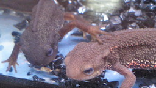  |   |

解答 >> [answers/answer_98.py](https://github.com/yoyoyo-yo/Gasyori100knock/blob/master/Question_91_100/answers/answer_98.py)

## Q.99. 简单物体检测第三步----非极大值抑制（Non-Maximum Suppression）

虽然使用问题97中的方法可以粗略地检测出目标，但是 Bounding-box 的数量过多，这对于后面的处理流程是十分不便的。因此，使用非极大值抑制（（Non-Maximum Suppression））减少矩形的数量。

NMS 是一种留下高分 Bounding-box 的方法，算法如下：

1. 将 Bounding-box 的集合 B 按照分数从高到低排序；
2. 分数最高的记为 b0；
3. 计算 b0和其它 Bounding-box 的 IoU。从 B 中删除高于 IoU 阈值 t的 Bounding-box。将 B0 添加到输出集合 R 中，并从 B 中删除。
4. 重复步骤 2 和步骤 3 直到 B 中没有任何元素；
5. 输出 R。

在问题98的基础上增加 NMS（阈值 t=0.25），并输出图像。请在答案中 Bounding-box 的左上角附上分数。

不管准确度如何，这样就完成了图像检测的一系列流程。通过增加神经网络，可以进一步提高检测精度。

| 输入 (images/imori_many.jpg) | NMS前(answers/answer_98.jpg) | NMS後(answers/answer_99.jpg) |
| :-------------------: | :--------------------------: | :--------------------------: |
|    |    |    |

解答 >> [answers/answer_99.py](https://github.com/yoyoyo-yo/Gasyori100knock/blob/master/Question_91_100/answers/answer_99.py)


## Q.100. 简单物体检测第三步----评估 Precision, Recall, F-score, mAP

最后是第100个问题！ ！ ！

在这里我们对检测效果作出评估。

如果 Bounding-box 和其两个类不匹配，则无法评估检测的准确性。对于检测效果的评价指标，我们有Recal、Precision、F-score、mAP等。

### Recall ... 正解の矩形がどれだけ検出できたか。正解をどれだけ網羅できたかを示す。[0,1]の範囲を取り、1が最高。

```bash
G' ... Ground-truthの中で検出のどれかとIoUが閾値t以上となったGround-truthの数。
G ... Ground-truthの矩形の数。
Recall = G' / G
```
### Precision ... 検出がどれだけ正確に行われたかを示す。[0,1]の範囲を取り、1が最高。

```bash
D' ... 検出の中で、Ground-truthのどれかとIoUが閾値t以上となった検出の数。
D ... 検出の数。
Precision = D' / D
```

### F-score ... RecallとPrecisonの調和平均。　２つのバランスを示すもので、[0,1]の範囲を取り、1が最高。

```bash
F-scoer = 2 * Recall * Precision / (Recall + Precision)
```

文字を検出する文字検出はRecall, Precision, F-scoreで精度を測ることが多い。

### mAP ... Mean Average Precision。物体を検出する物体検出では、mAPで測ることが多い。mAPの計算方法は少し複雑である。

1. 各検出に関してGround-truthとのIoUが閾値t以上かどうかを判断して、表を作成する。
```bash
   Detect | judge
------------------
  detect1 |   1   (1はGround-truthとのIoU>=tとなったもの)
  detect2 |   0   (0はGround-truthとのIoU<tとなったもの)
  detect3 |   1
```
2. mAP = 0として、上から順に見て、judgeが1の時は、見ているものの上すべてに関して、Precisionを計算し、mAPに加算する。
3. 上から順に2を行い、全て行ったら、加算回数でmAPを割る。

以上でmAPが求まる。上の例でいうと、
1. detect1 が1なので、Precisionを求める。Precision = 1/1 = 1なので、mAP = 1
2. detect2 が0なので、無視。
3. detect3 が1なので、Precisionを求める。Precision = 2/3 = 0.67 なので、 mAP = 1 + 0.67 = 1.67
4. mAPに加算したのは計2回なので、mAP = 1.67 / 2 = 0.835
となる。


ここでは、閾値t=0.5として、Recall, Precision, F-score, mAPを算出せよ。
Ground-truthは次とする。
```python
# [x1, y1, x2, y2]
GT = np.array(((27, 48, 95, 110), (101, 75, 171, 138)), dtype=np.float32)
```

ここでは、GTとのIoUが0.5以上の検出を赤、それ以外を青にして描画せよ。

解答
```bash
Recall >> 1.00 (2.0 / 2)
Precision >> 0.25 (2.0 / 8)
F-score >>  0.4
mAP >> 0.0625
```

| 输入 (images/imori_many.jpg) | GT(answers/answer_100_gt.jpg)  | 输出(answers/answer_100.jpg) |
| :-------------------: | :----------------------------: | :--------------------------: |
|    |  |   |

解答 >> [answers/answer_100.py](https://github.com/yoyoyo-yo/Gasyori100knock/blob/master/Question_91_100/answers/answer_100.py)

