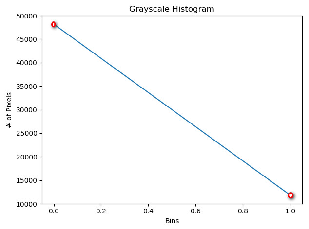

# Q. 101 - 150

## Q.51. 利用直方图判断图像的像素种类情况（Histogram）

比如在一副二值图像当中，我们需要判断是黑底白字还是白底黑字。

通常有一个特性是，字符所占的像素不足图片像素的一半，这样直接判断是黑底白字还是白底黑字。

第二种方法是，如果对于上一种的情况会出现反例的情况，我们可以先对四周的像素进行全采样，
一般情况下，图片周边的像素更多的一定是背景像素，它所对应的类别便是背景。

| 输入 (images/seg.png) | 输出(answers/answer_101.jpg) |
| :------------: | :-------------------------: |
|    |   |

可以看到，我们输出是两个类别，黑色像素值有48154.0 白色像素值有11846.0，黑色个数远多于白色个数，所以可以认定这是一个黑底白字的图像。

答案 >> [answers/answer_101.py](https://github.com/yeLer/ImageProcessing100Wen/tree/master/Question_101_110/answers/answer_101.py)

