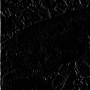

# Q. 1 - 10

## Q.1. 通道交换

读取图像，然后将 RGB 通道替换成 BGR 通道。

下面的代码用于提取图像的红色通道。注意，`cv2.imread()` 的系数是按 BGR 顺序排列的！其中的变量 `red` 表示的是仅有原图像红通道的 `imori.jpg`。

```python
import cv2
img = cv2.imread("imori.jpg")
red = img[:, :, 2].copy()
```

| 输入 (imori.jpg) | 输出 (answers/answer_1.jpg) |
| :--------------: | :-------------------------: |
|    |    |

答案 
Python >> [answers/answer_1.py](https://github.com/yeLer/ImageProcessing100Wen/blob/master/Question_01_10/answers/answer_1.py)
C++ >> [answers_cpp/answer_1.py](https://github.com/yeLer/ImageProcessing100Wen/blob/master/Question_01_10/answers_cpp/answer_1.py)

## Q.2. 灰度化（Grayscale）

将图像灰度化吧！灰度是一种图像亮度的表示方法，通过下式计算：

Y = 0.2126 R + 0.7152 G + 0.0722 B

| 输入 (imori.jpg) | 输出 (answers/answer_2.jpg) |
| :--------------: | :-------------------------: |
|    |    |

答案
Python >> [answers/answer_2.py](https://github.com/yeLer/ImageProcessing100Wen/blob/master/Question_01_10/answers/answer_2.py)
C++ >> [answers_cpp/answer_2.py](https://github.com/yeLer/ImageProcessing100Wen/blob/master/Question_01_10/answers_cpp/answer_2.py)
## Q.3. 二值化（Thresholding）

把图像进行二值化吧！二值化是将图像使用黑和白两种值表示的方法。这里我们将灰度的阈值设置为 128 来进行二值化，即：

```bash
y = { 0 (if y < 128)
     255 (else) 
```

| 输入 (imori.jpg) | 输出 (answers/answer_3.jpg) |
| :--------------: | :-------------------------: |
|    |    |

答案 
Python >> [answers/answer_3.py](https://github.com/yeLer/ImageProcessing100Wen/blob/master/Question_01_10/answers/answer_3.py)
C++ >> [answers_cpp/answer_3.py](https://github.com/yeLer/ImageProcessing100Wen/blob/master/Question_01_10/answers_cpp/answer_3.py)
## Q.4. 大津二值化算法（Otsu's Method）

使用大津算法来二值化图像吧！大津算法，也被称作最大类间方差法，是一种可以自动确定二值化中阈值的算法，从类内[方差](https://ja.wikipedia.org/wiki/%E5%88%86%E6%95%A3_(%E7%A2%BA%E7%8E%87%E8%AB%96))和类间方差的比值计算得来：


- 小于阈值 t 的类记作 0，大于阈值 t 的类记作 1；
- w0 和 w1 是被阈值 t 分开的两个类中的像素数占总像素数的比率（满足 w0+w1=1）；
- S0^2, S1^2 是这两个类中像素值的方差；
- M0, M1 是这两个类的像素值的平均值；

也就是说：

```bash
类内方差：Sw^2 = w0 * S0^2 + w1 * S1^2
类间方差：Sb^2 = w0 * (M0 - Mt)^2 + w1 * (M1 - Mt)^2 = w0 * w1 * (M0 - M1) ^2
图像所有像素的方差：St^2 = Sw^2 + Sb^2 = (const)
根据以上的式子，我们用以下的式子计算分离度：  
分离度 X = Sb^2 / Sw^2 = Sb^2 / (St^2 - Sb^2)
```

也就是说： 

```bash
argmax_{t} X = argmax_{t} Sb^2
```
换言之，如果使 Sb^2 =  w0 * w1 * (M0 - M1) ^2 最大，就可以得到最好的二值化阈值 t。

| 输入 (imori.jpg) | 输出 (th = 127) (answers/answer_4.jpg) |
| :--------------: | :------------------------------------: |
|    |               |

答案
Python >> [answers/answer_4.py](https://github.com/yeLer/ImageProcessing100Wen/blob/master/Question_01_10/answers/answer_4.py)
C++ >> [answers_cpp/answer_4.py](https://github.com/yeLer/ImageProcessing100Wen/blob/master/Question_01_10/answers_cpp/answer_4.py)

## Q.5. HSV 变换

将使用 HSV 表示色彩的图像的色相反转吧！

HSV 即使用**色相（Hue）、饱和度（Saturation）、明度（Value）**来表示色彩的一种方式。

- 色相：将颜色使用0到360度表示，就是平常所说的颜色名称，如红色、蓝色。色相与数值按下表对应：

  | 红  | 黄  | 绿  | 青色 | 蓝色 | 品红 | 红  |
  | --- | --- | --- | ---- | ---- | ---- | --- |
  | 0   | 60  | 120 | 180  | 240  | 300  | 360 |

- 饱和度：是指色彩的纯度，饱和度越低则颜色越黯淡( 0<= S < 1)；
- 明度：即颜色的明暗程度。数值越高越接近白色，数值越低越接近黑色 ( 0 <= V < 1)；

从 RGB 色彩表示转换到 HSV 色彩表示通过以下方式计算：

R,G,B的值在[0, 1]之间：

```bash
Max = max(R,G,B)
Min = min(R,G,B)

H =  { 0                            (if Min=Max)
       60 x (G-R) / (Max-Min) + 60  (if Min=B)
       60 x (B-G) / (Max-Min) + 180 (if Min=R)
       60 x (R-B) / (Max-Min) + 300 (if Min=G)
       
V = Max

S = Max - Min
```

从 HSV 色彩表示转换到 RGB 色彩表示通过以下方式计算：

```bash
C = S

H' = H / 60

X = C (1 - |H' mod 2 - 1|)

(R,G,B) = (V - C) (1,1,1) + { (0, 0, 0)  (if H is undefined)
                              (C, X, 0)  (if 0 <= H' < 1)
                              (X, C, 0)  (if 1 <= H' < 2)
                              (0, C, X)  (if 2 <= H' < 3)
                              (0, X, C)  (if 3 <= H' < 4)
                              (X, 0, C)  (if 4 <= H' < 5)
                              (C, 0, X)  (if 5 <= H' < 6)
```
请将色相反转（色相值加180），然后再用 RGB 色彩空间表示图片。

| 输入 (imori.jpg) | 输出 (answers/answer_5.jpg) |
| :--------------: | :-------------------------: |
|    |    |

答案 
Python >> [answers/answer_5.py](https://github.com/yeLer/ImageProcessing100Wen/blob/master/Question_01_10/answers/answer_5.py)
C++ >> [answers_cpp/answer_5.py](https://github.com/yeLer/ImageProcessing100Wen/blob/master/Question_01_10/answers_cpp/answer_5.py)

## Q.6. 减色处理

> 这里没有找到"減色処理"准确的中文翻译，所以直译了。
>
> ——gzr

这里我们将图像的值由256^3压缩至4^3，即将 RGB 的值只取 {32, 96, 160, 224}。这被称作色彩量化。色彩的值按照下面的方式定义：

```bash
val = {  32  (  0 <= val <  64)
         96  ( 64 <= val < 128)
        160  (128 <= val < 192)
        224  (192 <= val < 256)
```
| 输入 (imori.jpg) | 输出 (answers/answer_6.jpg) |
| :--------------: | :-------------------------: |
|    |    |

答案 
Python >> [answers/answer_6.py](https://github.com/yeLer/ImageProcessing100Wen/blob/master/Question_01_10/answers/answer_6.py)
C++ >> [answers_cpp/answer_6.py](https://github.com/yeLer/ImageProcessing100Wen/blob/master/Question_01_10/answers_cpp/answer_6.py)

## Q.7. 平均池化（Average Pooling）

将图片按照固定大小网格分割，网格内的像素值取网格内所有像素的平均值。我们将这种把图片使用均等大小网格分割，并求网格内代表值的操作称为池化（Pooling）。池化操作是卷积神经网络（Convolutional Neural Network）中重要的图像处理方式。平均池化按照下式定义：

```bash
v = 1/|R| * Sum_{i in R} v_i
```

请把大小为 128x128 的`imori.jpg`使用 8x8 的网格做平均池化。

| 输入 (imori.jpg) | 输出 (answers/answer_7.jpg) |
| :--------------: | :-------------------------: |
|    |    |

答案 
Python >> [answers/answer_7.py](https://github.com/yeLer/ImageProcessing100Wen/blob/master/Question_01_10/answers/answer_7.py)
C++ >> [answers_cpp/answer_7.py](https://github.com/yeLer/ImageProcessing100Wen/blob/master/Question_01_10/answers_cpp/answer_7.py)

## Q.8. 最大池化（Max Pooling）

网格内的值不取平均值，而是取网格内的最大值进行池化操作。

| 输入 (imori.jpg) | 输出 (answers/answer_8.jpg) |
| :--------------: | :-------------------------: |
|    |    |

答案
Python >> [answers/answer_8.py](https://github.com/yeLer/ImageProcessing100Wen/blob/master/Question_01_10/answers/answer_8.py)
C++ >> [answers_cpp/answer_8.py](https://github.com/yeLer/ImageProcessing100Wen/blob/master/Question_01_10/answers_cpp/answer_8.py)

## Q.9. 高斯滤波（Gaussian Filter）

使用高斯滤波器（3x3 大小，标准差 s=1.3​）来对`imori_noise.jpg`进行降噪处理吧！

高斯滤波器是一种可以使图像平滑的滤波器，用于去除噪声。可用于去除噪声的滤波器还有中值滤波器（参见问题10），平滑滤波器（参见问题11）、LoG 滤波器（参见问题19）。

高斯滤波器将中心像素周围的像素按照高斯分布加权平均进行平滑化。这样的（二维）权值通常被称为卷积核或者滤波器。

但是，由于图像的长宽可能不是滤波器大小的整数倍，因此我们需要在图像的边缘补0。这种方法称作 Zero Padding。并且权值（卷积核）要进行[归一化操作](https://blog.csdn.net/lz0499/article/details/54015150)(sum g = 1)。

```bash
权值 g(x,y,s) = 1/ (s*sqrt(2 * pi)) * exp( - (x^2 + y^2) / (2*s^2))
标准差 s = 1.3 的 8 近邻 高斯滤波器如下：
            1 2 1
K =  1/16 [ 2 4 2 ]
            1 2 1
```

| 输入 (imori_noise.jpg) | 输出 (answers/answer_9.jpg) |
| :--------------------: | :-------------------------: |
|    |    |

答案 
Python >> [answers/answer_9.py](https://github.com/yeLer/ImageProcessing100Wen/blob/master/Question_01_10/answers/answer_9.py)
C++ >> [answers_cpp/answer_9.py](https://github.com/yeLer/ImageProcessing100Wen/blob/master/Question_01_10/answers_cpp/answer_9.py)

## Q.10 中值滤波（Median filter）

使用中值滤波器（3x 3大小）来对`imori_noise.jpg`进行降噪处理吧！

中值滤波器是一种可以使图像平滑的滤波器。这种滤波器用滤波器范围内（在这里是3x3）像素点的中值进行滤波，在这里也采用 Zero Padding。

| 输入 (imori_noise.jpg) | 输出 (answers/answer_10.jpg) |
| :--------------------: | :--------------------------: |
|    |    |

答案 
Python >> [answers/answer_10.py](https://github.com/yeLer/ImageProcessing100Wen/blob/master/Question_01_10/answers/answer_10.py)
C++ >> [answers_cpp/answer_10.py](https://github.com/yeLer/ImageProcessing100Wen/blob/master/Question_01_10/answers_cpp/answer_10.py)

# Q.11 - 20

## Q.11. 均值滤波器

使用均值滤波器（3x3）来进行滤波吧！

均值滤波器使用网格内像素的平均值。

| 输入 (imori.jpg) | 输出 (answers/answer_11.jpg) |
| :--------------: | :--------------------------: |
|    |    |

答案 >> [answers/answer_11.py](https://github.com/yeLer/ImageProcessing100Wen/blob/master/Question_11_20/answers/answer_11.py)


## Q.12. Motion Filter

使用3x3的 Motion Filter 来进行滤波吧。

Motion Filter 取对角线方向的像素的平均值，像下式这样定义：

```bash
  1/3  0   0
[  0  1/3  0 ]
   0   0  1/3
```

| 输入 (imori.jpg) | 输出 (answers/answer_12.jpg) |
| :--------------: | :--------------------------: |
|    |    |

答案 >> [answers/answer_12.py](https://github.com/yeLer/ImageProcessing100Wen/blob/master/Question_11_20/answers/answer_12.py)

## Q.13. MAX-MIN 滤波器

使用 MAX-MIN 滤波器来进行滤波吧。

MAX-MIN 滤波器使用网格内像素的最大值和最小值的差值对网格内像素重新赋值。通常用于**边缘检测**。边缘检测用于检测图像中的线。像这样提取图像中的信息的操作被称为**特征提取**。边缘检测通常在灰度图像上进行。

| 输入 (imori.jpg) | 输出 (answers/answer_13.jpg) |
| :--------------: | :--------------------------: |
|    |    |

答案 >> [answers/answer_13.py](https://github.com/yeLer/ImageProcessing100Wen/blob/master/Question_11_20/answers/answer_13.py)


## Q.14. 微分滤波器

使用3x3的微分滤波器来进行滤波吧。

微分滤波器对图像亮度急剧变化的边缘有提取效果，可以获得邻接像素的差值。

```bash
    (a)纵向         (b)横向
      0 -1  0            0 0 0
K = [ 0  1  0 ]   K = [ -1 1 0 ]
      0  0  0            0 0 0
```

| 输入 (imori.jpg) | 输出・纵向 (answers/answer_14_v.jpg) | 输出・横向 (answers/answer_14_h.jpg) |
| :--------------: | :----------------------------------: | :----------------------------------: |
|    |          |          |

答案 >>[ answers/answer_14.py](https://github.com/yeLer/ImageProcessing100Wen/blob/master/Question_11_20/answers/answer_14.py)

## Q.15. Sobel 滤波器

使用3x3的 Sobel 滤波器来进行滤波吧。

Sobel 滤波器可以提取特定方向的边缘，滤波器按下式定义：

```bash
    (a)纵向       (b)横向
      1 0 -1            1  2  1
K = [ 2 0 -2 ]   K = [  0  0  0 ]
      1 0 -1           -1 -2 -1
```

| 输入 (imori.jpg) | 输出・纵向 (answers/answer_15_v.jpg) | 输出・横向 (answers/answer_15_h.jpg) |
| :--------------: | :----------------------------------: | :----------------------------------: |
|    |          |          |

答案 >> [answers/answer_15.py](https://github.com/yeLer/ImageProcessing100Wen/blob/master/Question_11_20/answers/answer_15.py)

## Q.16. Prewitt 滤波器

使用3x3的 Prewitt 滤波器来进行滤波吧。

Prewitt 滤波器是用于边缘检测的一种滤波器，使用下式定义：

```bash
    (a)纵向          (b)横向
      -1 -1 -1          -1 0 1
K = [  0  0  0 ]  K = [ -1 0 1 ]
       1  1  1          -1 0 1
```

| 输入 (imori.jpg) | 输出・纵向 (answers/answer_16_v.jpg) | 输出・横向 (answers/answer_16_h.jpg) |
| :--------------: | :----------------------------------: | :----------------------------------: |
|    |          |          |

答案 >> [answers/answer_16.py](https://github.com/yeLer/ImageProcessing100Wen/blob/master/Question_11_20/answers/answer_16.py)


## Q.17. Laplacian 滤波器

使用 Laplacian 滤波器来进行滤波吧。

Laplacian 滤波器是对图像亮度进行二次微分从而检测边缘的滤波器。由于数字图像是离散的，x 方向和 y 方向的一次微分分别按照以下式子计算：

```bash
Ix(x,y) = (I(x+1, y) - I(x,y)) / ((x+1)-x) = I(x+1, y) - I(x,y)
Iy(x,y) = (I(x, y+1) - I(x,y)) / ((y+1)-y) = I(x, y+1) - I(x,y)
```

因此二次微分按照以下式子计算：

```bash
Ixx(x,y) = (Ix(x,y) - Ix(x-1,y)) / ((x+1)-x) = Ix(x,y) - Ix(x-1,y)
         = (I(x+1, y) - I(x,y)) - (I(x, y) - I(x-1,y))
         = I(x+1,y) - 2 * I(x,y) + I(x-1,y)
Iyy(x,y) = ... = I(x,y+1) - 2 * I(x,y) + I(x,y-1)
```

特此，Laplacian 表达式如下：

```bash
D^2 I(x,y) = Ixx(x,y) + Iyy(x,y)
           = I(x-1,y) + I(x,y-1) - 4 * I(x,y) + I(x+1,y) + I(x,y+1)
```

如果把这个式子表示为卷积核是下面这样的：

```bash
      0  1  0
K = [ 1 -4  1 ]
      0  1  0
```

| 输入 (imori.jpg) | 输出(answers/answer_17.jpg) |
| :--------------: | :-------------------------: |
|    |   |  |

答案 >> [answers/answer_17.py](https://github.com/yeLer/ImageProcessing100Wen/blob/master/Question_11_20/answers/answer_17.py)

## Q.18. Emboss 滤波器

使用 Emboss 滤波器来进行滤波吧。

Emboss 滤波器可以使物体轮廓更加清晰，按照以下式子定义：

```bash
      -2 -1  0
K = [ -1  1  1 ]
       0  1  2
```

| 输入 (imori.jpg) | 输出(answers/answer_18.jpg) |
| :--------------: | :-------------------------: |
|    |   |

答案 >> [answers/answer_18.py](https://github.com/yeLer/ImageProcessing100Wen/blob/master/Question_11_20/answers/answer_18.py)

## Q.19. LoG 滤波器

使用 LoG  滤波器，来对`imori_noise.jpg`检测边缘吧！

 LoG  即高斯-拉普拉斯（ Laplacian of Gaussian ）的缩写，使用高斯滤波器使图像平滑化之后再使用拉普拉斯滤波器使图像的轮廓更加清晰。

为了防止拉普拉斯滤波器计算二次微分会使得图像噪声更加明显，所以我们首先使用高斯滤波器来抑制噪声。

 LoG  滤波器使用以下式子定义：

```bash
LoG(x,y) = (x^2 + y^2 - s^2) / (2 * pi * s^6) * exp(-(x^2+y^2) / (2*s^2))
```

| 输入 (imori_noise.jpg) | 输出 (answers/answer_19.jpg) |
| :--------------------: | :--------------------------: |
|    |    |

答案 >> [answers/answer_19.py](https://github.com/yeLer/ImageProcessing100Wen/blob/master/Question_11_20/answers/answer_19.py)

## Q.20. 直方图

使用`Matplotlib`来绘制`imori_dark.jpg`的直方图吧！

直方图显示了不同数值的像素出现的次数。在`Matplotlib`中有`hist()`函数提供绘制直方图的接口。

| 输入 (imori_dark.jpg) | 输出 (answers/answer_20.png) |
| :-------------------: | :--------------------------: |
|    |    |

答案 >> [answers/answer_20.py](https://github.com/yeLer/ImageProcessing100Wen/blob/master/Question_11_20/answers/answer_20.py)

# Q. 21 - 30


## Q.21. 直方图归一化（ Histogram Normalization ）

> 关于直方图的几个操作的中文翻译一直都十分混乱（成龙抓头.jpg）。下面是我查了资料做的一个对照表，仅供参考：
>
> |         中文         |               English                |            日本語            |             具体作用             |
> | :------------------: | :----------------------------------: | :--------------------------: | :------------------------------: |
> | 直方图匹配（规定化） | Histogram Matching ( Specification ) |    ヒストグラムマッチング    | 将两张图像的累积分布函数调为一样 |
> |     直方图均衡化     |        Histogram Equalization        | ヒストグラム均等化（平坦化） |     拉开灰度差别，增强对比度     |
> |     直方图归一化     |       Histogram Normalization        |      ヒストグラム正規化      |  将直方图所有分量限制在一定范围  |
>
> ——gzr

来归一化直方图吧！

有时直方图会存在偏差。比如说，数据集中在 0 处（左侧）的图像全体会偏暗，数据集中在255 处（右侧）的图像会偏亮。如果直方图有所偏向，那么其[动态范围（ dynamic range ）](https://zh.wikipedia.org/wiki/%E5%8A%A8%E6%80%81%E8%8C%83%E5%9B%B4)就会较低。为了使人能更清楚地看见图片，让直方图归一化、平坦化是十分必要的。

这种归一化直方图的操作被称作灰度变换（Grayscale Transformation）。像素点取值范围从 [c,d] 转换到 [a,b] 的过程由下式定义。这回我们将`imori_dark.jpg`的灰度扩展到 [0, 255] 范围。

```bash
xout = {  a                         (xin < c)
         (b-a)/(d-c) * (xin-c) + a  (c <= xin <= d)
          b                         (d < xin)
```

| 输入 (imori_dark.jpg) | 输出 (answers/answer_21_1.jpg) | 直方图(answers/answer_21_2.png) |
| :-------------------: | :----------------------------: | :-----------------------------: |
|    |    |     |

答案 >> [answers/answer_21.py](https://github.com/yeLer/ImageProcessing100Wen/blob/master/Question_21_30/answers/answer_21.py)

## Q.22. 直方图操作

让直方图的平均值m0=128，标准差s0=52​吧！

这里并不是变更直方图的动态范围，而是让直方图变得平坦。

可以使用下式将平均值为m标准差为s的直方图变成平均值为m0标准差为s0的直方图：

```bash
xout = s0 / s * (xin - m) + m0
```

| 输入 (imori_dark.jpg) | 输出 (answers/answer_22_1.jpg) | 直方图(answers/answer_22_2.png) |
| :-------------------: | :----------------------------: | :-----------------------------: |
|    |    |     |

答案 >> [answers/answer_22.py](https://github.com/yeLer/ImageProcessing100Wen/blob/master/Question_21_30/answers/answer_22.py)

## Q.23. 直方图均衡化（ Histogram Equalization ）

来让均匀化直方图吧！

直方图均衡化是使直方图变得平坦的操作，是不需要计算上面的问题中的平均值、标准差等数据使直方图的值变得均衡的操作。

均衡化操作由以下式子定义。S是总的像素数；Zmax是像素点的最大取值（在这里是 255）；h(z)表示取值为z的累积分布函数：

```bash
Z' = Zmax / S * Sum{i=0:z} h(z)
```

| 输入 (imori.jpg) | 输出 (answers/answer_23_1.jpg) | 直方图(answers/answer_23_2.png) |
| :--------------: | :----------------------------: | :-----------------------------: |
|    |    |     |

答案 >> [answers/answer_23.py](https://github.com/yeLer/ImageProcessing100Wen/blob/master/Question_21_30/answers/answer_23.py)


## Q.24. 伽玛校正（Gamma Correction）

> [这里](https://blog.csdn.net/candycat1992/article/details/46228771)是一篇写伽马校正比较好的文章，我觉得可以作为背景知识补充。
>
> ——gzr

对`imori_gamma.jpg`进行伽马校正（c=1,g=2.2）吧！

伽马校正用来对照相机等电子设备传感器的非线性光电转换特性进行校正。如果图像原样显示在显示器等上，画面就会显得很暗。伽马校正通过预先增大 RGB 的值来排除显示器的影响，达到对图像修正的目的。

由于下式引起非线性变换，在该式中，x被归一化，限定在[0,1]范围内。c是常数，g为伽马变量（通常取2.2）：

```bash
x' = c * Iin ^ g
```

因此，使用下面的式子进行伽马校正：

```bash
Iout = (1/c * Iin) ^ (1/g)
```

 

| 输入 (imori_gamma.jpg) | 输出 (answers/answer_24.jpg) |
| :--------------------: | :--------------------------: |
|    |    |

答案 >> [answers/answer_24.py](https://github.com/yeLer/ImageProcessing100Wen/blob/master/Question_21_30/answers/answer_24.py)


## Q.25. 最邻近插值（ Nearest-neighbor Interpolation ）

使用最邻近插值将图像放大1.5倍吧！

最近邻插值在图像放大时补充的像素取最临近的像素的值。由于方法简单，所以处理速度很快，但是放大图像画质劣化明显。

使用下面的公式放大图像吧！I'为放大后图像，I为放大前图像，a为放大率，方括号为取整操作：

```bash
I'(x,y) = I([x/a], [y/a])
```
| 输入 (imori.jpg) | 输出 (answers/answer_25.jpg) |
| :--------------: | :--------------------------: |
|    |    |

答案 >> [answers/answer_25.py](https://github.com/yeLer/ImageProcessing100Wen/blob/master/Question_21_30/answers/answer_25.py)

## Q.26. 双线性插值（ Bilinear Interpolation ）

使用双线性插值将图像放大1.5倍吧！

双线性插值考察4邻域的像素点，根据距离设置权值。虽然计算量增大使得处理时间变长，但是可以有效抑制画质劣化。

1. 放大图像的座标(x',y')除以放大率a，得到对应原图像的座标floor(x'/a, y'/a)。
2. 求原图像的座标(x'/a, y'/a)周围4邻域的座标I(x,y), I(x+1,y), I(x,y+1), I(x+1, y+1)

```bash
I(x,y)    I(x+1,y) 
     * (x'/a,y'/a)
I(x,y+1)  I(x+1,y+1)
```

3. 分别求这4个点与(x'/a, y'/a)的距离，根据距离设置权重：w = d / Sum d
4. 根据下式求得放大后图像(x',y')处的像素值：
dx = x'/a - x , dy = y'/a - y
```bash
I'(x',y') = (1-dx)(1-dy)I(x,y) + dx(1-dy)I(x+1,y) + (1-dx)dyI(x,y+1) + dxdyI(x+1,y+1)
```

| 输入 (imori.jpg) | 输出 (answers/answer_26.jpg) |
| :--------------: | :--------------------------: |
|    |    |

答案 >> [answers/answer_26.py](https://github.com/yeLer/ImageProcessing100Wen/blob/master/Question_21_30/answers/answer_26.py)

## Q.27. 双三次插值（ Bicubic Interpolation ）

使用双三次插值将图像放大1.5倍吧！

双三次插值是双线性插值的扩展，使用邻域16像素进行插值。

```bash
I(x-1,y-1)  I(x,y-1)  I(x+1,y-1)  I(x+2,y-1)
I(x-1,y)    I(x,y)    I(x+1,y)    I(x+2,y)
I(x-1,y+1)  I(x,y+1)  I(x+1,y+1)  I(x+2,y+1)
I(x-1,y+2)  I(x,y+2)  I(x+1,y+2)  I(x+2,y+2)
```

各自像素间的距离由下式决定：

```bash
dx1 = x'/a - (x-1) , dx2 = x'/a - x , dx3 = (x+1) - x'/a , dx4 = (x+2) - x'/a
dy1 = y'/a - (y-1) , dy2 = y'/a - y , dy3 = (y+1) - y'/a , dy4 = (y+2) - y'/a
```

基于距离的权重函数由以下函数取得，a在大部分时候取-1：

```bash
h(t) = { (a+2)|t|^3 - (a+3)|t|^2 + 1    (when |t|<=1)
         a|t|^3 - 5a|t|^2 + 8a|t| - 4a  (when 1<|t|<=2)
         0                              (when 2<|t|) 
```

利用上面得到的权重，通过下面的式子扩大图像。将每个像素与权重的乘积之和除以权重的和。

```bash
I'(x', y') = (Sum{i=-1:2}{j=-1:2} I(x+i,y+j) * wxi * wyj) / Sum{i=-1:2}{j=-1:2} wxi * wyj
```

| 输入 (imori.jpg) | 输出 (answers/answer_27.jpg) |
| :--------------: | :--------------------------: |
|    |    |

答案 >> [answers/answer_27.py](https://github.com/yeLer/ImageProcessing100Wen/blob/master/Question_21_30/answers/answer_27.py)

## Q.28. 仿射变换（ Afine Transformations ）——平行移动

利用仿射变换让图像在x方向上+30，在y方向上-30吧！

仿射变换利用3x3的矩阵来进行图像变换。

变换的方式有平行移动（问题28）、放大缩小（问题29）、旋转（问题30）、倾斜（问题31）等。

原图像记为(x,y)，变换后的图像记为(x',y')。

图像放大缩小矩阵为下式：

```bash
[ x' ] = [a b][x]
  y'      c d  y
```

另一方面，平行移动按照下面的式子计算：

```bash
[ x' ] = [x] + [tx]
  y'      y  +  ty
```

把上面两个式子盘成一个：

```bash
  x'       a b tx    x
[ y' ] = [ c d ty ][ y ]
  1        0 0  1    1
```

特别的，使用以下的式子进行平行移动：

```bash
  x'       1 0 tx    x
[ y' ] = [ 0 1 ty ][ y ]
  1        0 0  1    1
```

| 输入 (imori.jpg) | 输出 (answers/answer_28.jpg) |
| :--------------: | :--------------------------: |
|    |    |

答案 >> [answers/answer_28.py](https://github.com/yeLer/ImageProcessing100Wen/blob/master/Question_21_30/answers/answer_28.py)

## Q.29. 仿射变换（ Afine Transformations ）——放大缩小

1. 使用仿射变换，将图片在x方向上放大1.3倍，在y方向上缩小至0.8倍。
2. 在上面的条件下，同时在x方向上像右平移30（+30），在y方向上向上平移30（-30）。

| 输入 (imori.jpg) | 输出 (1) (answers/answer_29_1.jpg) | 输出 (2) (answers/answer_29_2.jpg) |
| :--------------: | :--------------------------------: | :--------------------------------: |
|    |        |        |

答案 >> [answers/answer_29.py](https://github.com/yeLer/ImageProcessing100Wen/blob/master/Question_21_30/answers/answer_29.py)

## Q.30. 仿射变换（ Afine Transformations ）——旋转

1. 使用仿射变换，逆时针旋转30度。
2. 使用仿射变换，逆时针旋转30度并且能让全部图像显现（也就是说，单纯地做仿射变换会让图片边缘丢失，这一步中要让图像的边缘不丢失，需要耗费一些工夫）。

使用下面的式子进行逆时针方向旋转A度的仿射变换：

```bash
  x'       cosA -sinA tx    x
[ y' ] = [ sinA  cosA ty ][ y ]
  1         0     0    1    1
```

| 输入 (imori.jpg) | 输出 (1) (answers/answer_30_1.jpg) | 输出 (2) (answers/answer_30_2.jpg) |
| :--------------: | :--------------------------------: | :--------------------------------: |
|    |        |        |

答案 >> [answers/answer_30_1.py](https://github.com/yeLer/ImageProcessing100Wen/blob/master/Question_21_30/answers/answer_30_1.py) , [answers/answer_30_2.py](https://github.com/yeLer/ImageProcessing100Wen/blob/master/Question_21_30/answers/answer_30_2.py)

# Q. 31 - 40

## Q.31. 仿射变换（Afine Transformations）——倾斜

1. 使用仿射变换，输出（1）那样的x轴倾斜30度的图像（dx=30），这种变换被称为`X-sharing`。
2. 使用仿射变换，输出（2）那样的y轴倾斜30度的图像（dy=30），这种变换被称为`Y-sharing`。
3. 使用仿射变换，输出（3）那样的x轴、y轴都倾斜30度的图像(dx = 30, dy = 30)。

原图像的大小为hxw，使用下面各式进行仿射变换。

```bash
(1) X-sharing                  (2) Y-sharing
   a = dx / h                     a = dy / w

  x'       1 a tx    x           x'       1 0 tx    x
[ y' ] = [ 0 1 ty ][ y ]       [ y' ] = [ a 1 ty ][ y ]
  1        0 0  1    1           1        0 0  1    1
```

| 输入 (imori.jpg) | 输出 (1) (answers/answer_31_1.jpg) | 输出 (2) (answers/answer_31_2.jpg) | 输出 (3) (answers/answer_31_3.jpg) |
| :--------------: | :--------------------------------: | :--------------------------------: | :--------------------------------: |
|    |        |        |        |

答案 >> [answers/answer_31.py](https://github.com/yeLer/ImageProcessing100Wen/blob/master/Question_31_40/answers/answer_31.py)

## Q.32. 傅立叶变换（Fourier Transform）

使用离散二维傅立叶变换（Discrete Fourier Transformation），将灰度化的`imori.jpg`表示为频谱图。然后用二维离散傅立叶逆变换将图像复原。

二维离散傅立叶变换是傅立叶变换在图像处理上的应用方法。通常傅立叶变换用于分离模拟信号或音频等连续一维信号的频率。但是，数字图像使用[0,255]范围内的离散值表示，并且图像使用HxW的二维矩阵表示，所以在这里使用二维离散傅立叶变换。

二维离散傅立叶变换使用下式计算，其中I表示输入图像：

```bash
K = 0:W, l = 0:H, 输入画像をI として
G(k,l) = Sum_{y=0:H-1, x=0:W-1} I(x,y) exp( -2pi * j * (kx/W + ly/H)) / sqrt(H * W)
```

在这里让图像灰度化后，再进行离散二维傅立叶变换。

频谱图为了能表示复数G，所以图上所画长度为G的绝对值。这回的图像表示时，请将频谱图缩放至[0,255]范围。

二维离散傅立叶逆变换从频率分量G按照下式复原图像：

```bash
x = 0:W, y = 0:H  として
I(x,y) = Sum_{l=0:H-1, k=0:W-1} G(k,l) exp( 2pi * j * (kx/W + ly/H)) / sqrt(H * W)
```

| 输入 (imori.jpg) | 灰度化 (imori_gray.jpg) | 输出 (answers/answer_32.jpg) | 频谱图 (answers/answer_32_ps.py) |
| :--------------: | :---------------------: | :--------------------------: | :------------------------------: |
|    |      |    |     |

答案 >> [answers/answer_32.py](https://github.com/yeLer/ImageProcessing100Wen/blob/master/Question_31_40/answers/answer_32.py)

## Q.33. 傅立叶变换——低通滤波

将`imori.jpg`灰度化之后进行傅立叶变换并进行低通滤波，之后再用傅立叶逆变换复原吧！

通过离散傅立叶变换得到的频率在左上、右上、左下、右下等地方频率较低，在中心位置频率较高。

在图像中，高频成分指的是颜色改变的地方（噪声或者轮廓等），低频成分指的是颜色不怎么改变的部分（比如落日的渐变）。在这里，使用去除高频成分，保留低频成分的低通滤波器吧！

在这里，假设从低频的中心到高频的距离为r，我们保留0.5r​的低频分量。

| 输入 (imori.jpg) | 灰度化 (imori_gray.jpg) | 输出 (answers/answer_33.jpg) |
| :--------------: | :---------------------: | :--------------------------: |
|    |      |    |

答案 >> [answers/answer_33.py](https://github.com/yeLer/ImageProcessing100Wen/blob/master/Question_31_40/answers/answer_33.py)

## Q.34. 傅立叶变换——高通滤波

将`imori.jpg`灰度化之后进行傅立叶变换并进行高通滤波，之后再用傅立叶逆变换复原吧！

在这里，我们使用可以去除低频部分，只保留高频部分的高通滤波器。假设从低频的中心到高频的距离为r，我们保留0.2r​的低频分量。

| 输入 (imori.jpg) | 灰度化 (imori_gray.jpg) | 输出 (answers/answer_34.jpg) |
| :--------------: | :---------------------: | :--------------------------: |
|    |      |    |

答案 >> [answers/answer_34.py](https://github.com/yeLer/ImageProcessing100Wen/blob/master/Question_31_40/answers/answer_34.py)

## Q.35. 傅立叶变换——带通滤波

将`imori.jpg`灰度化之后进行傅立叶变换并进行带通滤波，之后再用傅立叶逆变换复原吧！

在这里，我们使用可以保留介于低频成分和高频成分之间的分量的带通滤波器。在这里，我们使用可以去除低频部分，只保留高频部分的高通滤波器。假设从低频的中心到高频的距离为r，我们保留0.1r至0.5r的分量。  

| 输入 (imori.jpg) | 灰度化 (imori_gray.jpg) | 输出 (answers/answer_35.jpg) |
| :--------------: | :---------------------: | :--------------------------: |
|    |      |    |

答案 >> [answers/answer_35.py](https://github.com/yeLer/ImageProcessing100Wen/blob/master/Question_31_40/answers/answer_35.py)

## Q.36. JPEG 压缩——第一步：离散余弦变换（Discrete Cosine Transformation）

`imori.jpg`灰度化之后，先进行离散余弦变换，再进行离散余弦逆变换吧！

离散余弦变换（Discrete Cosine Transformation）是一种使用下面式子计算的频率变换：

```bash
T = 8
F(u,v) = 1 / T * C(u)C(v) * Sum_{y=0:T-1} Sum_{x=0:T-1} f(x,y) cos((2x+1)u*pi/2T) cos((2y+1)v*pi/2T)
```

离散余弦逆变换（Inverse Discrete Cosine Transformation）是离散余弦变换的逆变换，使用下式定义：

```bash
f(x,y) = 1 / T * C(x)C(y) * Sum_{u=0:T-1} Sum_{v=0:T-1} F(u,v) cos((2x+1)u*pi/2T) cos((2y+1)v*pi/2T)
```

在这里我们先将图像分割成8x 8的小块，在各个小块中使用离散余弦变换编码，使用离散余弦逆变换解码，这就是 JPEG 的互逆过程。现在我们也同样地，把图像分割成8x 8的小块，然后进行离散余弦变换和离散余弦逆变换。

> 这一整段我整体都在瞎**译，原文如下：
>
> ここでは画像を8x8ずつの領域に分割して、各領域で以上のDCT, IDCTを繰り返すことで、JPEG符号に応用される。 今回も同様に8x8の領域に分割して、DCT, IDCTを行え。
>
> ——gzr

| 输入 (imori.jpg) | 灰度化 (imori_gray.jpg) | 输出 (1) (answers/answer_36.jpg) |
| :--------------: | :---------------------: | :------------------------------: |
|    |      |        |

答案 >> [answers/answer_36.py](https://github.com/yeLer/ImageProcessing100Wen/blob/master/Question_31_40/answers/answer_36.py)

## Q.37. PSNR

离散余弦逆变换中如果不使用8作为系数，而是使用4作为系数的话，图像的画质会变差。来求输入图像和经过离散余弦逆变换之后的图像的峰值信噪比吧！再求出离散余弦逆变换的比特率吧！

峰值信噪比（Peak Signal to Noise Ratio）缩写为PSNR，用来表示信号最大可能功率和影响它的表示精度的破坏性噪声功率的比值，可以显示图像画质损失的程度。

峰值信噪比越大，表示画质损失越小。峰值信噪比通过下式定义。MAX表示图像点颜色的最大数值。如果取值范围是[0,255]的话，那么MAX的值就为255。MSE表示均方误差（Mean Squared Error），用来表示两个图像各个像素点之间差值平方和的平均数。


```bash
PSNR = 10 * log10(MAX^2 / MSE)
MSE = Sum_{y=0:H-1} Sum_{x=0:W-1} (I1(x,y) - I2(x,y))^2 / (HW)
```

如果我们进行8x8的离散余弦变换，离散余弦逆变换的系数为KxK的话，比特率按下式定义：ビットレートとは8x8でDCTを行い、IDCTでKxKの係数までを用いた時に次式で定義される。

```bash
bitrate = 8 * K^2 / 8^2
```

| 输入 (imori.jpg) |       灰度化        | 输出 (answers/answer_37.jpg) (PSNR = 27.62, Bitrate=2.0) |
| :--------------: | :-----------------: | :------------------------------------------------------: |
|    |  |                                |

答案 >> [answers/answer_37.py](https://github.com/yeLer/ImageProcessing100Wen/blob/master/Question_31_40/answers/answer_37.py)

## Q.38. JPEG 压缩——第二步：离散余弦变换+量化

量化离散余弦变换系数并使用 离散余弦逆变换恢复。再比较变换前后图片的大小。

量化离散余弦变换系数是用于编码 JPEG 图像的技术。

量化即在对值在预定义的区间内舍入，其中`floor`、`ceil`、`round`等是类似的计算。

在 JPEG 图像中，根据下面所示的量化矩阵量化离散余弦变换系数。该量化矩阵取自 JPEG 软件开发联合会组织颁布的标准量化表。在量化中，将8x 8的系数除以（量化矩阵） Q 并四舍五入。之后然后再乘以 Q 。对于离散余弦逆变换，应使用所有系数。

```bash
Q = np.array(((16, 11, 10, 16, 24, 40, 51, 61),
              (12, 12, 14, 19, 26, 58, 60, 55),
              (14, 13, 16, 24, 40, 57, 69, 56),
              (14, 17, 22, 29, 51, 87, 80, 62),
              (18, 22, 37, 56, 68, 109, 103, 77),
              (24, 35, 55, 64, 81, 104, 113, 92),
              (49, 64, 78, 87, 103, 121, 120, 101),
              (72, 92, 95, 98, 112, 100, 103, 99)), dtype=np.float32)
```

由于量化降低了图像的大小，因此可以看出数据量已经减少。

| 输入 (imori.jpg) |     灰度化(9kb)     | 输出 (answers/answer_38.jpg) (7kb) |
| :--------------: | :-----------------: | :--------------------------------: |
|    |  |          |

答案 >> [answers/answer_38.py](https://github.com/yeLer/ImageProcessing100Wen/blob/master/Question_31_40/answers/answer_38.py)

## Q.39. JPEG 压缩——第三步：YCbCr 色彩空间

在 YCbCr 色彩空间内，将 Y 乘以0.7以使对比度变暗。

YCbCr 色彩空间是用于将图像由表示亮度的 Y、表示蓝色色度Cb以及表示红色色度Cr表示的方法。

这用于 JPEG 转换。

使用下式从 RGB 转换到 YCbCr：

```bash
Y = 0.299 * R + 0.5870 * G + 0.114 * B
Cb = -0.1687 * R - 0.3313 * G + 0.5 * B + 128
Cr = 0.5 * R - 0.4187 * G - 0.0813 * B + 128
```

使用下式从 YCbCr 转到 RGB：

```bash
R = Y + (Cr - 128) * 1.402
G = Y - (Cb - 128) * 0.3441 - (Cr - 128) * 0.7139
B = Y + (Cb - 128) * 1.7718
```

| 输入 (imori.jpg) | 输出 (answers/answer_39.jpg) |
| :--------------: | :--------------------------: |
|    |    |

答案 >> [answers/answer_39.py](https://github.com/yeLer/ImageProcessing100Wen/blob/master/Question_31_40/answers/answer_39.py)

## Q.40. JPEG 压缩——第四步：YCbCr+离散余弦变换+量化

将图像转为 YCbCr 色彩空间之后，进行 离散余弦变换再对 Y 用 Q1 量化矩阵量化，Cb 和 Cr 用 Q2 量化矩阵量化。最后通过离散余弦逆变换对图像复原。还需比较图像的容量。

这是实际生活中使用的减少 JPEG 数据量的方法，Q1 和 Q2 根据 JPEG 规范由以下等式定义：

```bash
Q1 = np.array(((16, 11, 10, 16, 24, 40, 51, 61),
               (12, 12, 14, 19, 26, 58, 60, 55),
               (14, 13, 16, 24, 40, 57, 69, 56),
               (14, 17, 22, 29, 51, 87, 80, 62),
               (18, 22, 37, 56, 68, 109, 103, 77),
               (24, 35, 55, 64, 81, 104, 113, 92),
               (49, 64, 78, 87, 103, 121, 120, 101),
               (72, 92, 95, 98, 112, 100, 103, 99)), dtype=np.float32)

Q2 = np.array(((17, 18, 24, 47, 99, 99, 99, 99),
               (18, 21, 26, 66, 99, 99, 99, 99),
               (24, 26, 56, 99, 99, 99, 99, 99),
               (47, 66, 99, 99, 99, 99, 99, 99),
               (99, 99, 99, 99, 99, 99, 99, 99),
               (99, 99, 99, 99, 99, 99, 99, 99),
               (99, 99, 99, 99, 99, 99, 99, 99),
               (99, 99, 99, 99, 99, 99, 99, 99)), dtype=np.float32)
```

| 输入 (imori.jpg) (13kb) | 输出 (answers/answer_40.jpg) (8kb) |
| :---------------------: | :--------------------------------: |
|           |          |

答案 >> [answers/answer_40.py](https://github.com/yeLer/ImageProcessing100Wen/blob/master/Question_31_40/answers/answer_40.py)

# Q. 41 - 50

## Q.41. Canny 边缘检测：第一步——边缘强度

问题41至问题43是边缘检测方法中的一种——Canny 边缘检测法的理论介绍。

1. 使用高斯滤波；
2. 在x方向和y方向上使用 Sobel 滤波器，在此之上求出边缘的强度和边缘的梯度；
3. 对梯度幅值进行非极大值抑制（Non-maximum suppression）来使边缘变得更细；
4. 使用滞后阈值来对阈值进行处理。

上面就是图像边缘检测的方法了。在这里我们先完成第一步和第二步。按照以下步骤进行处理：
1. 将图像进行灰度化处理；
2. 将图像进行高斯滤波（5x 5,s=1.4）；
3. 在x方向和y方向上使用 Sobel 滤波器，在此之上求出边缘梯度fx和fy。边缘梯度可以按照下式求得：

```bash
梯度幅值 edge = sqrt(fx^2 + fy^2)
梯度方向 tan = arctan(fy / fx)
```

4. 使用下面的公式将梯度方向量化：

```bash
angle = {   0  (if -0.4142 < tan <= 0.4142)
           45  (if  0.4142 < tan < 2.4142)
           90  (if  |tan| >= 2.4142)
          135  (if -2.4142 < tan <= -0.4142)
```

请使用`numpy.pad()`来设置滤波器的`padding`吧！

| 输入 (imori.jpg) | 输出(梯度幅值) (answers/answer_41_1.jpg) | 输出(梯度方向) (answers/answer_41_2.jpg) |
| :--------------: | :--------------------------------------: | :--------------------------------------: |
|    |              |              |

答案 >> [answers/answer_41.py](https://github.com/yeLer/ImageProcessing100Wen/blob/master/Question_41_50/answers/answer_41.py)

## Q.42. Canny 边缘检测：第二步——边缘细化

在这里我们完成 Canny 边缘检测的第三步。

我们从在第42问中求出的边缘梯度进行非极大值抑制，来对边缘进行细化。

非极大值抑制是对除去非极大值以外的值的操作的总称（这个术语在其它的任务中也经常出现）。

在这里，我们比较我们我们所关注的地方梯度的法线方向邻接的三个像素点的梯度幅值，如果该点的梯度值不比其它两个像素大，那么这个地方的值设置为0。

也就是说，我们在注意梯度幅值edge(x,y)的时候，可以根据下式由梯度方向angle(x,y)来变换edge(x,y)：

```bash
if angle(x,y)  = 0
 if edge(x,y), edge(x-1,y), edge(x+1,y)で edge(x,y)が最大じゃない
  then edge(x,y) = 0
if angle(x,y)  = 45
 if edge(x,y), edge(x-1,y+1), edge(x+1,y-1)で edge(x,y)が最大じゃない
  then edge(x,y) = 0
if angle(x,y)  = 90
 if edge(x,y), edge(x,y-1), edge(x,y+1)で edge(x,y)が最大じゃない
  then edge(x,y) = 0
if angle(x,y)  = 135
 if edge(x,y), edge(x-1,y-1), edge(x+1,y+1)で edge(x,y)が最大じゃない
  then edge(x,y) = 0
```

| 输入 (imori.jpg) | 输出 (answers/answer_42.jpg) |
| :--------------: | :--------------------------: |
|    |    |

答案 >> [answers/answer_42.py](https://github.com/yeLer/ImageProcessing100Wen/blob/master/Question_41_50/answers/answer_42.py)

## Q.43. Canny 边缘检测：第三步——滞后阈值

在这里我们进行 Canny 边缘检测的最后一步。

在这里我们将通过设置高阈值和低阈值来将梯度幅值二值化。

1. 如果梯度幅值edge(x,y)大于高阈值的话，令edge(x,y)=255；
2. 如果梯度幅值edge(x,y)小于低阈值的话，令edge(x,y)=0；
3. 如果梯度幅值edge(x,y)介于高阈值和低阈值之间并且周围8邻域内有比高阈值高的像素点存在，令edge(x,y)=255；

在这里，我们使高阈值为100，低阈值为30。顺便说一句，我们只需要在查看结果时判断阈值。

上面的算法就是 Canny 边缘检测算法了。

| 输入 (imori.jpg) | 输出 (answers/answer_43.jpg) |
| :--------------: | :--------------------------: |
|    |    |

答案 >> [answers/answer_43.py](https://github.com/yeLer/ImageProcessing100Wen/blob/master/Question_41_50/answers/answer_43.py)

## Q.44. 霍夫变换（Hough Transform）／直线检测——第一步：霍夫变换

1. 第44问到第46问进行霍夫直线检测算法。

   霍夫变换，是将座标由直角座标系变换到极座标系，然后再根据数学表达式检测某些形状（如直线和圆）的方法。当直线上的点变换到极座标中的时候，会交于一定的r,t的点。这个点即为要检测的直线的参数。通过对这个参数进行逆变换，我们就可以求出直线方程。

   方法如下：

   1. 我们用边缘图像来对边缘像素进行霍夫变换。
   2. 在霍夫变换后获取值的直方图并选择最大点。
   3. 对极大点的r和t的值进行霍夫逆变换以获得检测到的直线的参数。

   在这里，进行一次霍夫变换之后，可以获得直方图。算法如下：

   1. 求出图像的对角线长 rmax；

   2. 在边缘点(x，y)处，t取遍[0,179]，根据下式执行霍夫变换：

      ```
      r = x * cos(t) + y * sin(t)
      ```

   3. 做一个180x rmax大小的表，将每次按上式计算得到的表格(t,r)处的值加1。换句话说，这就是在进行投票，票数会在一定的地方集中。

这一次，使用`torino.jpg`来计算投票之后的表。使用如下参数进行 Canny 边缘检测：高斯滤波器(5x 5,s = 1.4),HT = 100,LT = 30。

| 输入 (thorino.jpg) | 输出 (answers/answer_44.jpg) |
| :----------------: | :--------------------------: |
|    |    |

答案 >> [answers/answer_44.py](https://github.com/yeLer/ImageProcessing100Wen/blob/master/Question_41_50/answers/answer_44.py)

## Q.45. 霍夫变换（Hough Transform）／直线检测——第二步：NMS

我们将在这里进行第2步。

在问题44​获得的表格中，在某个地方附近集中了很多票。这里，执行提取局部最大值的操作。

这一次，提取出投票前十名的位置，并将其表示出来。

NMS 的算法如下：
1. 在该表中，如果遍历到的像素的投票数大于其8近邻的像素值，则它不变。
2. 如果遍历到的像素的投票数小于其8近邻的像素值，则设置为0。

| 输入 (thorino.jpg) | 输出 (answers/answer_45.jpg) |
| :----------------: | :--------------------------: |
|    |    |

答案 >> [answers/answer_45.py](https://github.com/yeLer/ImageProcessing100Wen/blob/master/Question_41_50/answers/answer_45.py)

## Q.46. 霍夫变换（Hough Transform）／直线检测——第三步：霍夫逆变换

这里是将问题45中得到的极大值进行霍夫逆变换之后画出得到的直线。在这里，已经通过霍夫变换检测出了直线。

算法如下：
1. 极大值点(r,t)通过下式进行逆变换：

```bash
y = - cos(t) / sin(t) * x + r / sin(t)
x = - sin(t) / cos(t) * y + r / cos(t)
```

2. 对于每个局部最大点，使y = 0-H -1，x = 0-W -1，然后执行1中的逆变换，并在输入图像中绘制检测到的直线。请将线的颜色设置为红色(R,G,B) = (255, 0, 0)。

| 输入 (thorino.jpg) | 输出 (answers/answer_46.jpg) |
| :----------------: | :--------------------------: |
|    |    |

答案 >> [answers/answer_46.py](https://github.com/yeLer/ImageProcessing100Wen/blob/master/Question_41_50/answers/answer_46.py)

## Q.47. 形态学处理：膨胀（Dilate）

*将`imori.jpg`大津二值化之后，进行两次形态学膨胀处理。

モルフォロジー処理にとは二値化画像の白(255)マス部分を4近傍(上下左右1マス)に膨張、または1マスだけ収縮させる処理をいう。

この膨張と収縮を何度も繰り返すことで1マスだけに存在する白マスを消したり(Q.49. オープニング処理)、本来つながってほしい白マスを結合させたりできる(Q.50. クロージング処理)。

モルフォロジー処理の膨張(Dilation)アルゴリズムは、
注目画素I(x, y)=0で、I(x, y-1), I(x-1, y), I(x+1, y), I(x, y+1)のどれか一つが255なら、I(x, y) = 255 とする。


つまり、上の処理を2回行えば2マス分膨張できることになる。

例えば、[[0,1,0], [1,0,1], [0,1,0]] のフィルタを掛けた和が255を超えれば膨張である、と考える。

| 输入 (imori.jpg) | 大津の二値化(answers/answer_4.jpg) | 输出 (answers/answer_47.jpg) |
| :--------------: | :--------------------------------: | :--------------------------: |
|    |           |    |

答案 >> [answers/answer_47.py](https://github.com/yeLer/ImageProcessing100Wen/blob/master/Question_41_50/answers/answer_47.py)

## Q.48. 形态学处理：腐蚀（Erode）

将`imori.jpg`大津二值化之后，进行两次形态学腐蚀处理。

モルフォロジー処理の膨張(Erosion)アルゴリズムは、
注目画素I(x, y)=255で、I(x, y-1), I(x-1, y), I(x+1, y), I(x, y+1)のどれか一つが255なら、I(x, y) = 0 とする。

例えば、[[0,1,0], [1,0,1], [0,1,0]] のフィルタを掛けた和が255*4未満なら収縮である、と考える。

| 输入 (imori.jpg) | 大津の二値化(answers/answer_4.jpg) | 输出 (answers/answer_48.jpg) |
| :--------------: | :--------------------------------: | :--------------------------: |
|    |           |    |

答案 >> [answers/answer_48.py](https://github.com/yeLer/ImageProcessing100Wen/blob/master/Question_41_50/answers/answer_48.py)

## Q.49. 开运算（Opening Operation）

大津二值化之后，进行开运算（N=1）吧。

开运算，即先进行N次腐蚀再进行N次膨胀。

开运算可以用来去除仅存的小块像素。

| 输入 (imori.jpg) | 大津の二値化(answers/answer_4.jpg) | 输出 (answers/answer_49.jpg) |
| :--------------: | :--------------------------------: | :--------------------------: |
|    |           |    |

答案 >> [answers/answer_49.py](https://github.com/yeLer/ImageProcessing100Wen/blob/master/Question_41_50/answers/answer_49.py)

## Q.50. 闭运算（Closing Operation）

Canny 边缘检测之后，进行闭处理吧（N=1）。

闭运算，即先进行N次膨胀再进行N次腐蚀。

闭运算能够将中断的像素连接起来。

| 输入 (imori.jpg) | Canny(answers/answer_43.jpg) | 输出 (answers/answer_50.jpg) |
| :--------------: | :--------------------------: | :--------------------------: |
|    |    |    |

答案 >> [answers/answer_50.py](https://github.com/yeLer/ImageProcessing100Wen/blob/master/Question_41_50/answers/answer_50.py)
